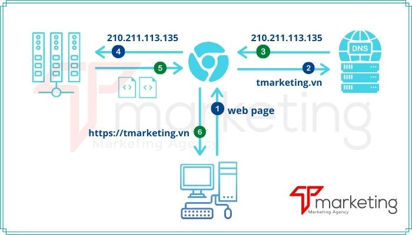

# Web FE - BUỔI 1 - HTML

- **Cách thức hoạt động của 1 trang web**
    - **Định nghĩa:** Website là một tập hợp trang thông tin có chứa các dạng hình ảnh, văn bản, video, audio,…  được lưu trữ trên web sever và người dùng có thể truy cập từ xa thông qua internet.
    - Web có thể được xây dựng bằng nhiều ngôn ngữ lập trình khác nhau (PHP, ASP.NET, Java, Ruby on Rails, Perl,…).
    - **Cách thức hoạt động**
        
        
        
        1. Đầu tiên người dùng nhập vào trình duyệt một địa chỉ có dạng: https://proptit.com , bạn có chỉ cần gõ “proptit.com” là trình duyệt sẽ tự hiểu và đổi thành đường dẫn ở trên.
        2. Sau đó trình duyệt gửi yêu cầu đến máy chủ **[DNS](https://tmarketing.vn/dns-la-gi-khai-niem-tong-quan/)**.
        3. Hệ thống DNS sẽ trả kết quả phân tích tên miền trong đường dẫn đã gửi là proptit.com, nó có địa chỉ máy chủ là **199.36.158.100**
        4. Sau khi nhận được địa chỉ IP – nơi lấy dữ liệu, trình duyệt sẽ tìm đến địa chỉ IP đã nhận – tức máy chủ chứa nội dung website.
        5. Máy chủ web nhận được yêu cầu truy xuất nội dung website và nó gửi một tập hợp các file bao gồm HTML, CSS , các tập tin đa phương tiện khác như âm thanh, hình ảnh (nếu có) cho trình duyệt;
        6. Trình duyệt “dịch” các file mà máy chủ đã gửi thành trang web mà chúng ta nhìn thấy trên màn hình.
    - **Web Hosting (Lưu trữ web)**
        - Là nơi lưu trữ mã nguồn và nội dung website. Web server được xác định bởi địa chỉ IP.
        - Các loại hosting phổ biến:
            - **Shared Hosting (Lưu trữ chia sẻ)**
                
                Là dịch vụ lưu trữ web trong đó nhiều trang web nằm trên một máy chủ web được kết nối với Internet. Đây thường là lựa chọn kinh tế nhất cho việc lưu trữ, vì tổng chi phí bảo trì máy chủ được phân bổ cho nhiều khách hàng.
                
            - **Dedicated Server Hosting (Lưu trữ máy chủ vật lý)**
                
                Là dịch vụ lưu trữ chuyên dụng, máy chủ chuyên dụng hoặc dịch vụ lưu trữ được quản lý là một loại lưu trữ Internet trong đó khách hàng thuê toàn bộ máy chủ không được chia sẻ với bất kỳ ai khác.
                
            - **VPS Hosting – Virtual Private Server Hosting (Lưu trữ máy chủ ảo riêng)**
                
                Là một máy ảo được một dịch vụ lưu trữ Internet bán dưới dạng dịch vụ. Máy chủ chuyên dụng ảo cũng có ý nghĩa tương tự. VPS chạy bản sao hệ điều hành của riêng mình và khách hàng có thể có quyền truy cập superuser vào phiên bản hệ điều hành đó, vì vậy họ có thể cài đặt hầu hết mọi phần mềm chạy trên HĐH đó.
                
            - **Cloud Hosting (Lưu trữ máy chủ đám mây)**
                
                Là mô hình điện toán sử dụng công nghệ máy tính và phát triển dựa vào mạng Internet. Thuật ngữ “đám mây” ở đây là lối nói ẩn dụ chỉ mạng Internet và như sự liên tưởng về độ phức tạp của các cơ sở hạ tầng chứa trong nó.
                
    - **Tên miền (Domain)**
        - Là địa chỉ website, có thể hiểu tên miền là tên thay thế cho địa chỉ IP của máy chủ web, bởi địa chỉ IP là một dãy số rất khó nhớ. Do đó người ta gán (định danh) địa chỉ IP thành một chuỗi ký tự và nó dễ nhớ hơn *(ví dụ: thay vì ghi nhớ địa chỉ **199.36.158.100** ta sẽ nhớ chuỗi “**proptit.com**” và tương tự, điều này được thực hiện với hàng triệu website khác).*
    - **Dữ liệu website**
        - Gọi chung cho tất cả các tập tin đa phương tiện như văn bản, âm thanh, hình ảnh, video,.. được lưu trữ trên máy chủ web.
    - **Mã nguồn website**
        - Để dễ hình dung, ở đây xem như mã nguồn là một phần mềm hoàn chỉnh nó được cài đặt lên web server/hosting của bạn, nó như công cụ để tạo lập và quản lý các nội dung trên website.
        - Các mã nguồn phổ biến
            
            
            | WordPress | Joomla | Drupal | Magento |
            | --- | --- | --- | --- |
            | OpenCart | CMS Made Simple | B2evolution |  |
            
    - **Web tĩnh & Web động**
        - **Web tĩnh:** Web tĩnh là web mà người quản trị *(những người không phải là lập trình viên)* không thể tùy ý thay đổi nội dung và hình ảnh mà phải cần kiến thức về lập trình, thường các website này rất ít tương tác của người dùng nên vế sau dạng này ít đươc sử dụng.
        - **Web Động:** Web động là web được viết kèm theo một bộ công cụ quản trị để tùy biến nội dung dành cho webmaster (người quản trị) có thể dễ dàng thay đổi nội dung, hình ảnh. Website động được thiết kế bởi các lập trình viên để làm sao cho phép website có thể thay đổi được nội dung thường xuyên.
        
- **Cấu trúc cơ bản của HTML**
    - **Định nghĩa:** HTML là chữ viết tắt của cụm từ **H**yper **T**ext **M**arkup **L**anguage ( Ngôn ngữ đánh dấu siêu văn bản)
    - **HTML không phải là ngôn ngữ lập trình.**
    - Cấu trúc cơ bản của trang HTML có dạng như sau, thường gồm 3 phần:
        
        ```html
        <!DOCTYPE html>
        <html>
          <head>
             <meta charset="UTF-8">
             <title>Tiêu đề/Nhan đề bài viết </title>
          </head>
          <body>
                Nội dung của trang sẽ nằm ở đây
          </body>
         </html>
        ```
        
        - **<!Doctype>**: Phần khai báo chuẩn của html hay xhtml.
            - Khai báo đây là một file có định dạng là **HTML5** để giúp trình duyệt biết bạn đang dùng phiên bản html bao nhiêu, có cũng được, không có cũng được nhưng sẽ bị hạn chế nhiều thẻ mới, thuộc tính trong thẻ mà trình duyệt không phát hiện được.
        - **<html></html>**: Cấu trúc file html
            - **<head></head>**: Phần khai báo ban đầu, khai báo về meta, title, css, javascript…
                - Thẻ `<head>` Nằm sau thẻ `<html>`, có thẻ đóng `</head>`, nó chứa những thẻ khai báo thông tin cho trang như tiêu đề, mô tả, bảng mã ký tự. `<head>` không hiển thị nội dung những gì nó chứa đựng ra ngoài.
                - Thuộc tính (attribute) `charset` nằm trong thẻ meta có nhiệm vụ khai báo bảng mã, ngôn ngữ tiếng việt nên dùng `UTF-8`
                - Thẻ `<title>` dùng để khai báo tiêu đề của trang, và gần như đây là bắt buộc phải có trong một file html.
            - **<body></body>**: Phần chứa nội dung của trang web, nơi hiển thị nội dung.
                - Thẻ `<body>` Nằm sau thẻ  `<head>`, có thẻ đóng `</body>` nằm trước `</html>`.
                - Body là nơi chứa những gì mà mọi người sẽ thấy trên trang như thanh menu, banner, quảng cáo.
            
        
        
        
- **HTML Block và Inline Elements**
    - **Tổng quan**
        - Hai cấp độ của phần tử HTML là block và inline, block là phần tử dạng khối dàn trải theo chiều đứng, còn inline là phần tử xuất hiện liên tục theo chiều ngang.
        - Quy tắc sử dụng là inline không chứa block.
        - Ngày nay có thể dùng CSS để chuyển đổi một phần tử ở dạng inline sang block và ngược lại với thuộc tính `css: display`
    - **Phần tử HTML cấp độ block (hiện thị dạng khối)**
        - **Định nghĩa**
            - Là những phần tử sắp xếp theo chiều đứng của phần tử cha, trình duyệt luôn tạo ra một dòng mới, rồi đến không gian dành cho phần tử này, và kết thúc là một dòng mới.
            - Mặc định phần tử dạng này, có chiều rộng chiếm hết chiều rộng phẩn tử cha, chiều cao mở rộng theo nội dung của nó.
            - Hai phần tử block thường được dùng là `<p>` và ``<div>``
                - `<p>` : Là phần tử được thiết kế để mô tả một đoạn nội dung (kiểu đoạn văn).
                - ``<div>``: Là phần tử được thiết kế để mô tả một bộ phần hoặc vùng chứa dữ liệu (có thể thay thế cho `<p>` , chứa khối cho nội dung khác)
        - **Minh họa**
            
            Ta có 3 block: block1, block2, block2.
            
            - Độ rộng của phần tử block mở rộng tối đa (thường bằng độ rộng phần tử chứa). Xem block1
            - Ba phần từ này hiện sắp xếp hiện thị theo chiều đứng của phần tử, nó luôn xuống dòng mới - kể cả phía trước không gian đủ cho nó chiếm giữ (block3 không nằm trái block2 và nằm dưới - tạo ra dòng mới phía trước).
            - Ví dụ này dùng CSS để thay đổi độ rộng của phần tử (block2, block2), nhưng nguyên tắc block nó không bị thay đổi
            - Chiều cao phần tử tùy thuộc vào nội dung nó chứa bên trong
            
            
            
        - **Các phần tử block trong HTML**
            
            `<address>`, `<article>`, `<aside>`, `<blockquote>`, `<canvas>`, `<dd>`, ``<div>``, `<dl>`, `<dt>`, `<fieldset>`, `<figcaption>`, `<figure>`, `<footer>`, `<form>`, `<h1>``<h6>`, `<header>`, `<hr>`, `<li>`, `<main>`, `<nav>``<noscript>`, `<ol>`, `<p>`, `<pre>`, `<section>`, `<table>`, `<tfoot>`, `<ul>`, `<video>`
            
    - **Phần tử HTML cấp độ inline** **(trong hàng)**
        - **Định nghĩa**
            - Là những phần tử chiếm không gian chiều ngang theo nội dung của phần tử, không tạo ra dòng mới (xuống dòng) trước và sau phần tử.
            - Thẻ mà ta hay dùng là ``<span>`` :
                - Tương tự như ``<div>`` nhưng được dùng trong inline.
                - Thẻ ``<span>`` được thêm vào đoạn văn nhưng không làm thay đổi thuộc tính cũng như hiển thị của đoạn văn đó. Vì vậy chúng được gọi là thẻ trung tính trong HTML. Nó chỉ bị thay đổi khi chúng ta tác động bằng CSS
        - **Minh họa**
            
            Ta có 3 inline: inline1, inline2, inline 3.
            
            - Chiều dài và rộng của inline sẽ bao gọn nội dung bên trong nó.
            
            
            
        - **Các phần tử inline**
            
            `<a>`, `<abbr>`, `<acronym>`, `<b>`, `<bdo>`, `<big>`, `<button>`, `<cite>`, `<code>`, `<dfn>`, `<em>`, `<i>`, ``, `<input>`, `<kbd>`, `<label>`, `<map>`, `<object>`, `<output>`, `<q>`, `<samp>`, `<script>`, `<select>`, `<small>`, ``<span>``, `<strong>`, `<sub>`, `<sup>`, `<textarea>`, `<time>`, `<tt>`, `<var>`
            
    - **Phân biệt ``<div>`` và ``<span>``**
        - Thẻ ``<div>`` dùng để gom nhóm nhiều thẻ HTML còn thẻ ``<span>`` dùng để gom nhóm thẻ inline HTML.
        - Nhóm thẻ block HTML thì mỗi thẻ sẽ chiếm hết một dòng
        - Chức năng thẻ ``<div>``: Phân chia hoặc gộp các thẻ, khu vực khác nhau để tiện cho việc quản lý cũng như css cho chúng.
        
        | Thẻ ``<div>`` | Thẻ ``<span>`` |
        | --- | --- |
        | là loại phần tử cấp độ block tổng quát | là loại phần tử cấp độ inline tổng quát |
        | thẻ phân vùng dùng để tạo ra các khối (block) trên trang web | thẻ định dạng văn bản được sử dụng để đánh dấu một phần nhỏ (inline) |
        | Nội dung bên trong thẻ `<div>` được hiển thị trên một dòng mới và được căn chỉnh theo chiều ngang của trang web. Thẻ div thường được sử dụng để tạo ra những phân vùng lớn, như header, footer, sidebar hoặc content. | Thẻ `<span>` không tạo ra một khối mới và thường được sử dụng để định dạng văn bản nhỏ hoặc để áp dụng các hiệu ứng trực tiếp lên các từ hoặc đoạn văn bản. |
        
- **Các thẻ cơ bản**
    - **Table**
        - **Định nghĩa**
            - Thẻ `<table>` trong HTML được sử dụng để hiển thị dữ liệu ở dạng bảng *(hàng * cột)*. Có thể có nhiều cột trong một hàng.
            - Các thẻ `<table>` trong HTML được sử dụng để quản lý việc bố cục trang web. Ví dụ: Phần tiêu đề, thanh điều hướng, nội dung trang, phần chân trang,... Nhưng bạn nên sử dụng thẻ ``<div>`` thay vì `<table>` để quản lý bố cục của trang.
        - ****Các thẻ định nghĩa bảng trong HTML****
            
            
            | Thẻ | Mô tả |
            | --- | --- |
            | `<table>` | Định nghĩa bảng. |
            | `<tr>` | Định nghĩa một hàng trong một bảng. |
            | `<th>` | Định nghĩa phần header (dòng đầu tiên) của bảng. |
            | `<td>` | Định nghĩa 1 ô của bảng. |
            | `<caption`> | Định nghĩa phụ đề bảng. |
            | `<colgroup>` | Chỉ định một nhóm của một hoặc nhiều cột trong một bảng để định dạng. |
            | `<col>` | Được sử dụng với thẻ `<colgroup>` để chỉ định thuộc tính cột cho mỗi cột. |
            | `<tbody>` | Được sử dụng để nhóm nội dung body trong một bảng. |
            | `<thead>` | Được sử dụng để nhóm nội dung header trong một bảng. |
            | `<tfooter>` | Được sử dụng để nhóm nội dung footer trong một bảng. |
            - `<tr>` có thể 1 hoặc nhiều thẻ `<th>` hoặc `<td>`
        - **Minh họa**
            
            ```html
            <table>
            	<tr>
            			<th>Month</th>
            			<th>Savings</th>
            	</tr>
            	<tr>
            		<td>January</td>
            		<td>$100</td>
            	</tr>
            </table>
            ```
            
            
            
            - Ngoài ra, `<table>` còn có các thuộc tính trong HTML nhưng không được khuyến khích dùng
            
    - **Thẻ Image và Links**
        - **Thẻ ``**
            - **Định nghĩa**
                - Dùng để nhúng một image vào văn bản HTML.
            - **Thuộc tính `src` và `alt`**
                
                Thẻ `` có 2 thuộc tính cần thiết là `src` và `alt`
                
                - `src`: đường dẫn tham chiếu tới image.
                - `alt`: được sử dụng như một văn bản thay thế khi image không hiển thị *(hoặc không có sẵn)*. Chú ý là `alt` không phải dùng để hiển thị khi di chuyển chuột lên image, muốn văn bản hiển thị khi di chuyển chuột lên image thì ta dùng thuộc tính `title` thay thế.
            - **Minh họa**
                
                ```html
                <p></p>
                ```
                
                
                
            - **Các thuộc tính khác**
                | Thuộc tính | Chú thích |
                | --- | --- |
                | border | Xác định độ dày của đường viền bao xung quanh tấm hình |
                | width | Thiết lập chiều rộng cho tấm hình |
                | height | Thiết lập chiều cao cho tấm hình |
                | vspace | Xác định khoảng cách lề phía trên và lề phía dưới của tấm hình |
                | hspace | Xác định khoảng cách lề bên trái và lề bên phải của tấm hình |
                | align | Xác định vị trí của tấm hình so với các văn bản xung quanh |
                | usemap | Xác định một "bản đồ hệ thống tọa độ của các vùng" để kết hợp với tấm hình, tạo ra một bản đồ ảnh. Bạn sẽ được tìm hiểu rõ về thuộc tính này trong bài thẻ <map> & <area> |
        - **Thẻ `<a>` (anchor)**
            - **Định nghĩa**
                - Thẻ `<a>` để tạo link, liên kết trong văn bản HTML với các thuộc tính href để thiết lập siêu liên kết hyperlink là URL chuyển đến, file, email, số điện thoại, thuộc tính target thiết lập cách mở link
            - **Thuộc tính cơ bản thường dùng**
                - **`href`**: Xác định đường dẫn đến tài liệu mà bạn muốn chuyển tới.
                    - Thuộc tính `href` dùng để xác định đường dẫn đến tài liệu mà bạn muốn chuyển tới. *(Đường dẫn ở đây có thể là đường dẫn tương đối hoặc đường dẫn tuyệt đối)*
                    
                    ```html
                    <p>- Liên kết bên dưới được xác định bởi đường dẫn tuyệt đối</p>
                    <a href="<http://webcoban.vn/css/default.html>">Tài liệu học CSS</a>
                    <p>- Liên kết bên dưới được xác định bởi đường dẫn tương đối</p>
                    <a href="../javascript/default.html">Tài liệu học JavaScript</a>
                    ```
                    
                    - Ngoài ra, thuộc tính `href` cũng có thể dùng để xác định một vị trí bên trong trang web mà bạn muốn di chuyển tới *(vị trí của phần tử được xác định dựa giá trị thuộc tính id của phần tử)*
                    
                    ```html
                    <a href="#css">Di chuyển đến phần tử có thuộc tính id với giá trị là "css"</a>
                    <h1 id="html">1) Tài liệu học HTML</h1>
                    ...
                    <h1 id="css">2) Tài liệu học CSS</h1>
                    ...
                    <h1 id="javascript">3) Tài liệu học JavaScript</h1>
                    ...
                    ```
                    
                - **`download`:** Khi người dùng bấm vào liên kết thì tài liệu của liên kết đó sẽ tự động được tải về
                    - Ta có thể thêm giá trị cho thuộc tính download để xác định tên của tập tin khi được lưu về máy tính.
                    
                    ```html
                    <a href="../image/flower.gif" download>Click here</a>
                    
                    <a href="../image/flower.gif" download="laptrinhweb">Click here</a>
                    ```
                    
                    - ***Lưu ý**:* Ta không cần phải xác định phần đuôi của tập tin vì hệ thống sẽ tự động làm việc đó.
                - **`target`:** Xác định nơi mà tài liệu sẽ được mở
                    - Thuộc tính target có bốn giá trị cơ bản

                    | Thuộc tính | Chú thích | Ví dụ |
                    | --- | --- | --- |
                    | _blank | Mở tài liệu trong một tab mới | [Xem ví dụ](https://webcoban.vn/html/demo?file=2246)|
                    | _self | Mở tài liệu trong khung hiện tại | [Xem ví dụ](https://webcoban.vn/html/demo?file=2247) |
                    | _parent | Mở tài liệu trong khung cha của khung hiện tại | [Xem ví dụ](https://webcoban.vn/html/demo?file=2248) |
                    | _top | Mở tài liệu trong tab hiện tại | [Xem ví dụ](https://webcoban.vn/html/demo?file=2249) |
                    
            - **Các thuộc tính khác**
                
                
                | Thuộc tính | Mô tả |
                | --- | --- |
                | hreflang | Dùng để chỉ định ngôn ngữ của tài liệu được liên kết. |
                | media | Dùng để chỉ định phương tiện / thiết bị mà tài liệu được liên kết được tối ưu hóa. |
                | ping | Dùng để chỉ định danh sách URL được phân tách bằng dấu cách, khi liên kết sau đó, các yêu cầu đăng với body ping sẽ được gửi bằng trình duyệt (trong bối cảnh). Được sử dụng để theo dõi. |
                | referrerpolicy | Dùng để chỉ định liên kết giới thiệu nào sẽ gửi. |
                | rel | Dùng để chỉ định mối quan hệ giữa tài liệu hiện tại và tài liệu được liên kết. |
                | type | Dùng để chỉ định loại phương tiện của tài liệu được liên kết. |
    - **Section elements**
        - **Phần tử ``<div>`` và ``<span>``**
            
            *(Đã tìm hiểu ở trên)*
            
        - **Phần tử `<section>`**
            - Dùng để khai báo cho các vị trí trên giao diện của một trang web.
            - Bạn có thể sử dụng `<section>` để bao quanh các vị trí như `<header>`, `<footer>`, `<sidebar>`,... Tuy nhiên, thực tế thì người ta vẫn thường sử dụng `<section>` trong phần nội dung chính của trang web, bởi vì chúng ta đã có rất nhiều thẻ cho các vị trí khác.
            - **Minh họa**
                
                ```html
                <!DOCTYPE html>
                <html>
                <body>
                	<section>
                		<h2>WWF History</h2>
                		<p>The World Wide Fund for Nature (WWF) is an international organization working on issues regarding the conservation, research and restoration of the environment, formerly named the World Wildlife Fund. WWF was founded in 1961.</p>
                	</section>
                	<section>
                		<h2>WWF's Symbol</h2>
                		<p>The Panda has become the symbol of WWF. The well-known panda logo of WWF originated from a panda named Chi Chi that was transferred from the Beijing Zoo to the London Zoo in the same year of the establishment of WWF.</p>
                	</section>
                </body>
                </html>
                ```
                
                
                
        - **Phần tử  `<header>`**
            - Phần tử `<header>` được dùng để khai báo phần đầu *(tiêu đề)* cho các bài viết, thậm chí là phần trên cùng của trang web. Bạn cũng đừng nhầm lẫn thẻ `<header>`với thẻ `<thead>` của `<table>` nhé.
            - Thông thường trong `<header>` sẽ chứa:
                - Một hoặc nhiều thẻ `<h1>` - `<h6>`
                - Icon hoặc Logo
                - Thông tin tác giả
            - ***Lưu ý:*** trong 1 file HTML có thể có nhiều `<header>` nhưng nó không thể nằm trong một `<footer>`, `<address>` hoặc một `<header>` khác.
            - **Minh họa**
                - Trong trang hiển thị danh sách bài viết, bạn sẽ dùng thẻ `<article>` để khai báo cho mỗi bài, bên trong mỗi `<article>` sẽ khai báo thêm thẻ `<header>` để bao phần tiêu đề của bài viết lại.
                
                ```html
                <article>
                  <header>
                    <h1>A heading here</h1>
                    <p>Posted by John Doe</p>
                    <p>Some additional information here</p>
                  </header>
                  <p>Lorem Ipsum dolor set amet....</p>
                </article>
                ```
                
                
                
            
        - **Phần tử `<footer>`**
            - Phần tử `<footer>` xác định phần chân cho một tài liệu hoặc một phần.
            - Một phần tử `<footer>` phải chứa thông tin về phần tử chứa nó.
            - Một phần tử `<footer>` thường chứa:
                - Thông tin tác giả.
                - Thông tin bản quyền.
                - thông tin liên lạc.
                - Sitemap.
                - Liên kết trở lại đầu trang.
                - tài liệu liên quan.
            - ***Lưu ý:*** Bạn có thể có nhiều phần tử `<footer>` trong một tài liệu.
            - ***Lưu ý #2:*** Thông tin liên hệ trong `<footer>` nên nằm trong thẻ <address>
            - **Minh họa**
                
                ```html
                <footer>
                	<p>Author: Hege Refsnes</p>
                	<p><a href="mailto:hege@example.com">hege@example.com</a></p>
                </footer>
                ```
                
                
                
        - **Phần tử `<nav>`**
            - Thẻ `<nav>` được dùng để bao bọc các vị trí liên quan đến liên kết và điều hướng chính cho trang web. Thường đó sẽ là các menu chính, menu phụ, danh sách chuyên mục bên sidebar, …
            - Chúng ta chỉ nên sử dụng thẻ nav đối với những link điều hướng chính cho trang web.
            - **Minh họa**
                
                ```html
                <nav>
                  <a href="/html/">HTML</a> |
                  <a href="/css/">CSS</a> |
                  <a href="/js/">JavaScript</a> |
                  <a href="/python/">Python</a>
                </nav>
                ```
                
                
                
        - **Phần tử `<main>`**
            - Thẻ main sẽ xác định nội dung chính của trang.
            - Những nội dung bên trong thẻ main phải là những nội dung chỉ xuất hiện duy nhất cho trang. Bên trong thẻ main không được chứa bất kì nội dung nào được lặp lại ở các trang khác nhau như: menu của trang, logo, bản quyền, các thanh sidebar…
            - Trong một tài liệu chỉ có duy nhất một thẻ `<main>` và thẻ `<main>` đó không được nằm trong các thẻ sau: `<article>`, `<aside>`, `<footer>`, `<header>`, hoặc `<nav>`.
            - **Minh họa**
                
                ```html
                <main>
                  <h1>Most Popular Browsers</h1>
                  <p>Chrome, Firefox, and Edge are the most used browsers today.</p>
                
                  <article>
                    <h2>Google Chrome</h2>
                    <p>Google Chrome is a web browser developed by Google, released in 2008. Chrome is the world's most popular web browser today!</p>
                  </article>
                
                  <article>
                    <h2>Mozilla Firefox</h2>
                    <p>Mozilla Firefox is an open-source web browser developed by Mozilla. Firefox has been the second most popular web browser since January, 2018.</p>
                  </article>
                
                  <article>
                    <h2>Microsoft Edge</h2>
                    <p>Microsoft Edge is a web browser developed by Microsoft, released in 2015. Microsoft Edge replaced Internet Explorer.</p>
                  </article>
                </main>
                ```
                
                
    - **Text content**
        - **Thẻ `<h1>` - `<h6>`**
            - Là các thẻ để đánh dấu các cấp headling.
            - Độ quan trọng của headline giảm dần từ `<h1>` *(quan trọng nhất)* xuống `<h6>` *(ít quan trọng nhất)*
            - Mỗi trang chỉ nên dùng 1 `<h1>` và không nên skip bất kỳ cấp độ heading nào cả.
            - **Minh họa**
                
                ```html
                <h1>This is heading 1</h1>
                <h2>This is heading 2</h2>
                <h3>This is heading 3</h3>
                <h4>This is heading 4</h4>
                <h5>This is heading 5</h5>
                <h6>This is heading 6</h6>
                ```
                
                
                
        - **Thẻ `<ul>`**
            - Thẻ `<ul>` sẽ định nghia một danh sách không định rõ thứ tự. Sử dụng kết hợp thẻ `<ul>` với thẻ `<li>` để tạo danh sách không đánh số.
            - **Minh họa**
                
                ```html
                <ul>
                  <li>Coffee</li>
                  <li>Tea</li>
                  <li>Milk</li>
                </ul>
                ```
                
                
                
        - **Thẻ `<ol>`**
            - Thẻ ol sẽ xác định một danh sách có thử tự, thứ tự sẽ được đánh theo số hoặc chữ cái.
            - Sử dụng thẻ li để xác định các mục trong danh sách.
            - **Minh họa**
                
                ```html
                <ol>
                  <li>Coffee</li>
                  <li>Tea</li>
                  <li>Milk</li>
                </ol>
                
                <ol start="50">
                  <li>Coffee</li>
                  <li>Tea</li>
                  <li>Milk</li>
                </ol>
                ```
                
                
                
        - **Thẻ `<li>`**
            - Thẻ `<li>` có chức năng định nghĩa một mục trong danh sách. Nó là một thẻ con, nằm bên trong hai thẻ cha là `<ol>` hoặc `<ul>`. Khi bạn cố tình đặt nó đứng riêng một mình thì sẽ bị lỗi sai cấu trúc HTML.
            - Sử dụng thẻ li trong các danh sách được sắp xếp `<ol>`, danh sách không được sắp xếp `<ul>` và trong các danh sách menu `<menu>`.
    - **Forms**
        - **Thẻ `<form>`**
            - Dùng để tạo một HTML form cho người dùng nhập vào.
            - Trong thẻ `<form>` có thể chưa một hoặc nhiều những phần tử sau:
        - **Thẻ `<input>`**
            - Định nghĩa một vùng mà người dùng có thể nhập vào dữ liệu.
            - Là thẻ quan trọng nhất trong phần Forms.
            - Nếu muốn bắt buộc người dùng phải nhập, không được để trống, ta thêm từ khóa `required` vào dòng thuộc tính của `<input>`.
            - Có rất nhiều kiểu thể loại input
                - `<input type="button">`
                - `<input type="checkbox">`
                - `<input type="color">`
                - `<input type="date">`
                - `<input type="datetime-local">`
                - `<input type="email">`
                - `<input type="file">`
                - `<input type="hidden">` (nhập vào bị ẩn ****)
                - `<input type="image">`
                - `<input type="month">`
                - `<input type="number">`
                - `<input type="password">`
                - `<input type="radio">` (Nút bấm)
                - `<input type="range">` (Thanh trượt)
                - `<input type="reset">`
                - `<input type="search">`
                - `<input type="submit">`
                - `<input type="tel">`
                - `<input type="text">` (default value)
                - `<input type="time">`
                - `<input type="url">`
                - `<input type="week">`
        - **Thẻ `<button>`**
            - Định nghĩa 1 nút mà ta có thể bấm.
            - Với `<button>`, bạn có thể thêm nội dung text (và các thẻ `<i>`,  `<b>`,  `<strong>`,  `<br>`,  ``, …) ở bên trong
            - ***Lưu ý:*** Luôn luôn phải định nghĩa `type` của `<button>` là gì, để cho trình duyệt có thể hiểu.
            - **Các thuộc tính của button**
                
                
                | Thuộc tính | Giá trị | Ví dụ | Mô tả |
                | --- | --- | --- | --- |
                | autofocus | autofocus | autofocus="autofocus" | Xác định một nút được "focus" khi tải trang. |
                | form | Tên form | form="formName" | Xác định form nào được button điều khiển. |
                | formaction | URL | formaction=" confirm.php" | Xác định trang khi action tới. |
                | formenctype | application/x-www-form-urlencodedmultipart/ form-datatext/plain | formenctype=" text/plain" | Xác định dữ liệu được mã hóa trước khi gửi tới máy chủ. |
                | formmethod | getpost | formmethod="post" | Xác định phương thức truyền dữ liệu tới máy chủ. |
                | formnovalidate | formnovalidate | formnovalidate=" formnovalidate" | Kiểm tra giá trị nhập trước khi gửi. |
                | formtarget | _blank_self_parent_top | formtarget="_blank" | Xác định nơi để mở một link khi action dữ liệu. |
                | disabled | disabled | disabled="disabled" | Chỉ định vô hiệu button |
                | name | tên | name="submitBtn" | Chỉ định tên cho button |
                | type | buttonresetsubmit | type="submit"
                type="reset"
                type="button" | Chỉ định kiểu của button |
                | value | giá trị, có thể bằng chữ hay số | value="Gửi" | Chỉ định các giá trị cơ bản của button
                Không hỗ trợ trong trình duyệt IE. |
        - **Thẻ `<label>`**
            - Thẻ `<label>` có tác dụng đặt nhãn để mô tả cho thẻ `<input>`. Thực chất thẻ `<label>` không hiển thị bất cứ thứ gì đặc biệt cho người dùng. Tuy nhiên, khi click vào nội dung bên trong thẻ `<label>`, con trỏ chuột sẽ tự động nhảy vào phần tử mà thẻ `<label>` đó đại diện.
            - ***Lưu ý:*** Thuộc tính `for` của thẻ `<label>` phải giống với với `id` của thẻ `<input>` mà nó đại diện.
            - Bạn có thể sử dụng thẻ ``<span>``, thẻ `<p>`, hay một thẻ bất kì để bao quanh thẻ `<label>` lại.
        - **Thẻ `<textarea>`**
            - Thẻ `<textarea>` sẽ tạo một vùng nhập liệu bao gồm nhiều dòng.
            - Vùng dữ liêu sẽ có số kí tự không hạn chế, do đó thẻ `<textarea>` được sử dụng trong những trường hợp muốn nhập nhiều dữ liệu. Các kí tự sẽ được biểu diễn băng font chữ nhất định( *thường là Courier*).
            - Kích thước của vùng nhập liệu có thể được xác định bởi cols và thuộc tính của rows hoặc thậm chí là các thuộc tính height và width từ CSS.
            - Các thuộc tính cơ bản
                
                
                | Thuộc tính | Giá trị | Ví dụ | Mô tả |
                | --- | --- | --- | --- |
                | cols | Số | cols="20" | Xác định chiều rộng hiển thị của `<textarea>`. |
                | rows | Số | rows="20" | Xác định số hàng hiển thị của `<textarea>`. |
                | autofocus | autofocus | autofocus="autofocus" | Xác định một trường `<textarea>` được "focus" khi tải trang. |
                | dirname | Tên trường | dirname="fieldName" | Xác định tên của một trường nhập có chứa các hướng văn bản của các vùng `<textarea>`. |
                | form | Tên form | form="formName" | Xác định trường `<textarea>` thuộc về form nào. |
                | maxlength | Số | maxlength="200" | Xác định số ký tự lớn nhất cho phép trong `<textarea>`. |
                | placeholder | text | placeholder="Chỉ chấp nhận số và chữ." | Xác định một gợi ý cho người dùng nhâp liệu. |
                | required | required | required="required" | Xác định giá trị bắt buộc của trường `<textarea>`. |
                | wrap | hard/soft | wrap="soft" | Xác định vùng văn bản được gói bằng cách nào. |
                | disabled | disabled | disabled="disabled" | Xác định vùng `<textarea>` không hiển thị. |
                | name | tên của textarea | name="texName" | Xác định tên của `<textarea>`. |
                | readonly | readonly | readonly="readonly" | Xác định vùng `<textarea>` chỉ được đọc. |
        - Thẻ `<select>`
        - Thẻ `<option>`
        - Thẻ `<optgroup>`
        - Thẻ `<fieldset>`
        - Thẻ `<output>`
        - **Minh họa**
            
            ```html
            <form action="/action_page.php" method="get">
              <label for="fname">First name:</label>
              <input type="text" id="fname" name="fname" required><br><br>
              
              <label for="lname">Last name:</label>
              <input type="text" id="lname" name="lname" required><br><br>
              
              <textarea id="w3review" name="w3review" rows="4" cols="50">At w3schools.com you will learn how to make a website. They offer free tutorials in all web development technologies.</textarea><br>
              
              <input type="submit" value="Submit">
              <button type="reset">Reset</button>
              
            </form>
            ```
            
            
            
    - **Các thẻ khác**
        - **Thẻ `<br>`**
            - Thẻ `<br>` có tác dụng ngắt dòng hiện tại và chuyển sang một dòng mới.
            - Thẻ `<br>` không có thẻ đóng.
        - **Thẻ `<hr>`**
            - Thẻ `<hr>` định nghĩa một sự gián đoạn theo chủ đề trong một trang HTML *(ví dụ như sự thay đổi chủ đề).*
            - Thẻ `<hr>` sẽ tạo một gạch ngăn giữa các chủ đề được phân cách.
        - **Minh họa**
            
            ```html
            <p>HTML is the standard markup language for creating Web pages. HTML describes the structure of a Web page, and consists of a series of elements. HTML elements tell the browser how to display the content.</p>
            <hr>
            <p>CSS is a language that describes how HTML elements are to be displayed on screen, paper, or in other media. CSS saves a lot of work, because it can control the layout of multiple web pages all at once.</p>
            <hr>
            <p>JavaScript is the programming language of HTML and the Web. JavaScript can change HTML content and attribute values. JavaScript can change CSS. JavaScript can hide and show HTML elements, and more.</p>
            ```
            
            
            
- **Bài tập**
    
    Tạo 1 trang thể hiện các cấu trúc cơ bản của 1 trang web.