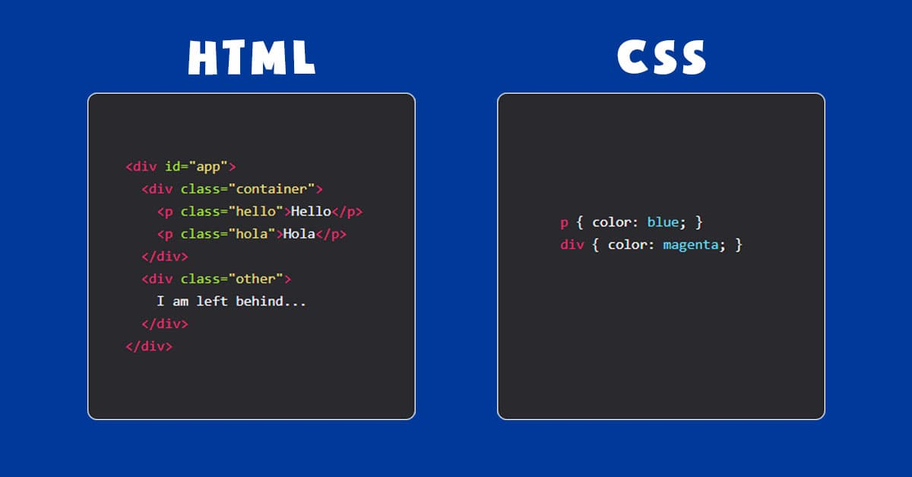

# Web FE - CSS

- **CSS là gì ?**
    - **CSS** là chữ viết tắt của Cascading Style Sheets, nó là một ngôn ngữ được sử dụng để **tìm và định dạng** lại các phần tử được tạo ra bởi các ngôn ngữ đánh dấu ([HTML](https://topdev.vn/blog/html-la-gi/)). Nói ngắn gọn hơn là ngôn ngữ tạo phong cách cho trang web.
    - Bạn có thể hiểu đơn giản rằng, nếu HTML đóng vai trò định dạng các phần tử trên website như việc tạo ra các đoạn văn bản, các tiêu đề, bảng,…thì CSS sẽ giúp chúng ta có thể thêm style vào các phần tử HTML đó như đổi bố cục, màu sắc trang, đổi màu chữ, font chữ, thay đổi cấu trúc…
    - **Bố cục CSS**
        
        Thường chủ yếu dựa vào hình hộp và mỗi hộp đều chiếm những khoảng trống trên trang của bạn với các thuộc tính như:
        
        - **Padding**: Gồm không gian xung quanh nội dung (ví dụ: xung quanh đoạn văn bản).
        - **Border**: Là đường liền nằm ngay bên ngoài phần đệm.
        - **Margin**: Là khoảng cách xung quanh bên ngoài của phần tử.
    - **Cấu trúc CSS**
        
        ```css
        vùng_chọn {    thuộc_tính : giá_trị;    thuộc_tính: giá_trị;    ..... }
        ```
        
    - **Các cách style cho HTML**
        - **External CSS**
            - Bằng việc sử dụng một file có tên gồm phần đuôi .css ở bên ngoài (ví dụ styles.css), bạn có thể thêm CSS style cho trang web.
            - Để sử dụng style sheet External, bạn thêm một đường dẫn đến nó trong mục `<head>` của mỗi trang HTML
            
            ```html
            <!DOCTYPE html>
            <html lang="en">
            <head>
                <meta charset="UTF-8">
                <link rel="stylesheet" href="style.css"/>
                <title>BaiTapBuoi1</title>
            </head>
            <body>
                <h1> ProPTIT Web  D21</h1>
            </body>
            </html>
            ```
            
            - Chỉ cần tệp không chứa bất kỳ mã HTML nào, và được lưu dưới tên có phần đuôi là `.css` là bạn có thể thêm CSS cho trang HTML với External.
        - **Internal CSS**
            - Ta ứng dụng phương pháp này khi muốn xác định kiểu cách cho một trang HTML. Internal CSS sẽ được định nghĩa trong mục `<head>` của mỗi trang HTML, cụ thể là trong phần tử `<style>`.
            
            ```html
            <!DOCTYPE html>
            <html>
            <head>
            	<style>
            	body {
            	  background-color: coral;
            	}
            	</style>
            </head>
            <body>
            	<h1>The background-color Property</h1>
            	<p>The background color can be specified with a color name.</p>
            </body>
            </html>
            ```
            
            - Với Internal, bạn có thể sử dụng các bộ chọn class và id trong style sheet này. Tuy nhiên, Internal CSS có thể làm cho kích thước và thời gian tải trang bị tăng lên.
        - **Inline CSS**
            - Khi bạn muốn mỗi phần tử HTML chỉ có một kiểu cách duy nhất thì hãy áp dụng Inline CSS. Phương pháp này sử dụng thuộc tính style của một phần tử HTML.
            - Phương pháp này sẽ rất hữu ích nếu bạn không có quyền truy cập vào một tệp CSS, hoặc nếu bạn chỉ muốn áp dụng một kiểu cách cho một phần tử duy nhất. Tuy nhiên Inline CSS không được ưa chuộng phổ biến bằng 2 cách trên. Lý do là bởi nó khiến việc quản lý website trở nên cồng kềnh, khó khăn hơn.
            
            ```html
            <table border="1px solid">
                <thead>
                    <tr>
                        <th>Tên</th>
                        <th>Tuổi</th>
                        <th>Quê quán</th>
                    </tr>
                </thead>
                <tbody>
                    <tr>
                        <th>Nguyễn Văn A</th>
                        <th>21</th>
                        <th>Hà Nội</th>
                    </tr>
                    <tr>
                        <th>Nguyễn Văn B</th>
                        <th>20</th>
                        <th>Hà Tây</th>
                    </tr>
                </tbody>
            </table>
            ```
            
- **CSS Selectors**
    - Là thứ cho phép bạn nhắm mục tiêu tới các phần tử HTML để áp dụng các thuộc tính CSS cho chúng.
    - CSS Selector giống như là đường đẫn, chỉ định để cho CSS biết bạn đang muốn điều chỉnh, tạo kiểu cho phần tử HTML nào vậy.
    
    
    
    - **Phân loại CSS Selectors**
        - **Basic CSS Selectors (Bộ chọn CSS cơ bản)**
            - **Element Selector**: `Element`. Nó chọn bất kỳ phần tử nào đó.
                
                ```css
                p { color: blue; }
                div { color: magenta; }
                ```
                
            - **Class Selector**: `.class`. Nó chọn tất cả các phần tử có `class` đã cho.
                
                ```css
                /*
                class="hello"
                */
                .hello {
                  color: red;
                }
                ```
                
            - **ID Selector**: `#id`. Nó chọn tất cả các phần tử có `id` đã cho.
                
                ```css
                #firstname {
                  background-color: yellow;
                }
                ```
                
            - **Universal selector**: `*`. Nó chọn tất cả các phần tử.
                
                ```css
                * {
                    background-color: yellow;
                }
                ```
                
        - **Descendant CSS Selectors** (Bộ chọn CSS hậu duệ)
            
            Cho đoạn HTML sau:
            
            ```html
            <div class="container">
              <div class="paragraph-container">
                <p id="hola-id" class="hola-class">Hola World</p>
                <p class="hello-class">Hello World</p>
                <p class="hello-class again-class">Hello Again World</p>
              </div>
            </div>
            ```
            
            - **Any descendant selector**: `A B`.
                - Chọn bất kỳ phần tử B nào là hậu duệ của A. Hậu duệ có thể được lồng rất sâu.
                
                ```css
                .container .hello-class {
                  color: red;
                }
                ```
                
            - **All descendant selector**: `*`.
                - Chọn toàn bộ hậu duệ.
                
                ```css
                .paragraph-container * {
                  color: blue;
                }
                ```
                
            - **Child Selector**: `A > B`.
                - Chỉ chọn hậu duệ trực tiếp.
                
                ```css
                .paragraph-container > .hello-class {
                  color: blue;
                }
                
                /*------------------------*/
                /*
                Code này không dùng được bởi không tìm thấy hậu duệ trực tiếp
                */
                .container > .hello-class {
                  color: blue;
                }
                ```
                
        - **Multiple CSS Selector** (Bộ chọn nhiều CSS)
            
            Cho đoạn HTML sau:
            
            ```html
            <div class="container">
              <div class="paragraph-container">
                <p id="hola-id" class="hola-class">Hola world</p>
                <p class="hello-class">Hello world</p>
                <p class="hello-class again-class">Hello again world</p>
              </div>
              <p class="outside-class">I'm outside</p>
            </div>
            ```
            
            - Multiple CSS Selector cho phép chúng ta chọn nhiều phần tử không liên quan với nhau.
            - **Multiple CSS Selector**: `A, B, C, D ...` .
                - Để chọn nhiều phần tử / class / id.
                
                ```css
                .outside-class, .again-class, .hola-class {
                  color: purple;
                }
                ```
                
        - **Combination CSS Selectors** (Bộ chọn CSS kết hợp)
            
            Cho đoạn HTML sau
            
            ```html
            <div class="container">
              <div class="paragraph-container">
                <p id="hola-id" class="hola-class">Hola world</p>
                <p class="hello-class">Hello world</p>
                <p class="hello-class active">Hello again world</p>
              </div>
              <p class="outside-class">I'm outside</p>
            </div>
            ```
            
            - Conbination CSS Selector cho phép bạn chọn thành phần rất cụ thể bằng nhiều tham chiếu.
            - **Combination CSS Selector**: `AB`.
                - Cho phép chọn phần tử chứa cả A và B. Cú pháp trông giống như Descendant CSS Selector, ngoại trừ phần này không có khoảng trắng.
                
                ```css
                p.active {
                  color: yellow;
                }
                ```
                
            - **Note**
                - Trường hợp sử dụng phổ biến nhất là hiệu ứng làm nổi bật button khi được di chuột (hovered) / nhấp (clicked) bằng cách cung cấp cho chúng một class `.active`.
                - Chúng ta có thể kết hợp nhiều thứ, không phải chỉ có class. (Nhớ là để chúng sát với nhau)
                
                ```css
                p#hola-id {
                  color: blue;
                }
                .hello-class.active {
                  color: red;
                }
                ```
                
        - **Sibling CSS Selectors** (Bộ chọn CSS anh em ruột)
            
            Cho đoạn HTML sau:
            
            ```html
            <div class="container">
              <div class="paragraph-container">
                <p id="hola-id" class="hola-class">Hola world</p>
                <p class="hello-class">Hello world</p>
                <p class="hello-class again-class">Hello again world</p>
              </div>
              <p class="outside-class">I'm outside</p>
            </div>
            ```
            
            - Sibling CSS Selector nhắm chọn các phần tử anh chị em.
            - **Bộ chọn Anh / Chị / Em liền kề** *(Nghiêm ngặt)*: `A + B`.
                - Nhắm mục tiêu một phần tử anh chị em được **đặt ngay sau** phần tử đó. *(Nếu cách nhau cũng không được, như **#hola-id** và **.again-class** cũng không)*
                
                ```css
                #hola-id + .hello-class {
                  color: blue;
                }
                ```
                
            - **Bộ chọn Anh / Chị / Em liền kề** *(Không nghiêm ngặt)*: `A ~ B`.
                - Giống như bộ chọn bên trên nhưng không giới hạn 1 phần tử đầu tiên.
                
                ```css
                #hola-id ~ .hello-class {
                  color: purple;
                }
                ```
                
                - Nó chọn cả thẻ `<p>` bên dưới vì chúng là phần tử anh chị em với nhau và có class là `.hello-class`
                - *Bộ chọn này không hoạt động ngược lại.*
        - **Pseudo CSS Selectors**
            
            Cho đoạn HTML sau:
            
            ```html
            <div class="container">
              <div class="paragraph-container">
                <p id="hola-id" class="hola-class">Hola world</p>
                <p class="hello-class">Hello world</p>
                <p class="hello-class again-class">Hello again world</p>
              </div>
            
              <p class="outside-class">I'm outside</p>
            
              <ul id="list-id" class="list-class">
                <li class="list-item-class">First</li>
                <li class="list-item-class">Second</li>
                <li class="list-item-class">Third</li>
                <li class="list-item-class">Fourth</li>
                <li class="list-item-class">Fifth</li>
              </ul>
            
              <div class="single-paragraph-container">
                <p>I'm the only child of this span</p>
              </div>
            </div>
            ```
            
            - **Chọn phần tử đầu tiên**: `A:first-child`.
                - Nó chọn đến phần tử con đầu tiên. (`A` phải có cha mẹ).
                
                ```css
                li:first-child {
                  color: blue;
                }
                ```
                
            - **Chọn phần tử con cuối cùng**: `A:last-child`.
                - Hoạt động như `A:first-child`, ngoại trừ thay vì chọn phần tử con đầu tiên, nó chọn phần tử con cuối cùng.
                
                ```css
                li:last-child {
                  color: purple;
                }
                ```
                
            - **Chỉ chọn phần tử con**: `A:only-child`.
                - Chọn tất cả A là con **duy nhất** của cha mẹ nó. Tương tự như bộ chọn phần tử con đầu tiên (`A:first-child`) và phần tử con cuối cùng (`A:last-child`). Ngoại trừ mục tiêu không được có anh chị em nào.
                
                ```css
                p:only-child {
                  color: red;
                }
                ```
                
                - Lưu ý mặc dù chúng ta có một số phần tử `<p>`, chỉ phần tử cuối cùng được áp dụng vì các phần tử `<p>` khác không phải là phần tử con duy nhất của cha mẹ chúng.
                - Nói cách khác, phần tử con có anh chị em thì không được áp dụng.
            - **Bộ chọn phần tử con thứ N**: `A:nth-child(n)`.
                - Nó chọn từng mục tiêu là con thứ `n` của cha mẹ nó.
                - Tất cả phần tử A là con thứ n của cha mẹ nó thì nó đều được chọn.
                
                ```css
                p:nth-child(2) {
                  color: red;
                }
                ```
                
                ***Hỏi:** Bạn dự đoán xem đoạn code trên sẽ có bao nhiêu phần tử đổi màu ?*
                
            - **Bộ chọn con thứ N cuối cùng**: `A:nth-last-child(n)`.
                - Nó tương tự như bộ chọn con thứ N, ngoại trừ nó được tính từ cuối cùng.
            - **Không chọn**: `A:not(B)`.
                - Chọn tất cả các phần tử A mà không phải B.
                
                ```css
                p:not(.outside-class) {
                  color: blue;
                }
                ```
                
            - **Bộ chọn loại đầu tiên**: `A:first-of-type`.
                - Nó chọn phần tử đầu tiên thuộc loại này trong số các phần tử anh chị em của nó.
                
                ```css
                p:first-of-type {
                  color: red;
                }
                ```
                
            - **Bộ chọn loại thứ N**: `A:nth-of-type(n)`.
                - Cũng giống như hai bộ chọn trên, nhưng nó chọn phần tử thứ N.
            - **Bộ chọn Only type**: `A:only-of-type`.
                - Chọn phần tử chỉ có loại đó, không có Anh / Chị / Em cùng loại.
        - **Pseudo CSS Selectors** (link và input)
            
            Cho đoạn HTML sau
            
            ```html
            <div id="app">
              <a class="cheesyLink" href="#">I like cheese</a>
              <a class="sweetLink" href="#">I like donut</a>
              <div class="burger">I like cheezburger</div>
              <div class="container">
                <form onsubmit="event.preventDefault()">
                  <input class="myinput"type="text" />
                  <input class="mysubmit" type="submit" />
                </form>
              </div>
            </div>
            ```
            
            - Chúng thường được liên kết với các liên kết (`a`) (mặc dù chúng có thể hoạt động với các phần tử không liên kết `non-link`).
            - **Hover Selector**: `A:hover`.
                - Chọn phần tử được hover (di chuột tới). Thường được sử dụng để làm nổi bật các liên kết.
                
                ```css
                a:hover {
                  color: red;
                }
                ```
                
            - **Focus Selector**: `A:focus`.
                - Chọn phần tử bạn đang tập trung vào nó. Thường được sử dụng với `input`.
                
                ```css
                input:focus {
                  background: red;
                }
                ```
                
            - **Active Selector**: `A:active`.
                - Chọn phần tử đang có trạng thái active. Khi bạn click vào nó, nền (background) sẽ thay đổi.
                
                ```css
                .cheesyLink:active {
                  background: red;
                }
                ```
                
            - **Link Selector**: `A:link`.
                - Nó chọn tất cả các link chưa được click.
                
                ```css
                a:link {
                  background: blue;
                }
                ```
                
        - Pseudo CSS Elements
            - Pseudo CSS Elements được sử dụng để tạo kiểu cho các phần được chỉ định của một phần tử.
            
            ```css
            selector::pseudo-element {
              property: value;
            }
            ```
            
            - ****`::before`****
                - Đây có lẽ là pseudo-element được sử dụng nhiều và thông dụng nhất. `pseudo-element` thường được sử dụng để thêm text, hình ảnh hay bất kỳ nội dung gì phía trước nội dung của phần tử được chọn.
            - ****`::after`****
                - Tương tự như `::before`, `::after` cũng được sử dụng để thêm nội dung nhưng là vào phía sau phần tử được chọn.
            - ****`::selection`****
                - Pseudo-element này được dùng để style cho một vùng văn bản được người dùng chọn (hay còn gọi là "**bôi đen**"). Chỉ có một số thuộc tính css khả dụng với `::selection` là `color`, `background`, `curso`, và `outline`.
                
                ```css
                ::selection {
                    color: red;
                    background: yellow;
                }
                ```
                
                
                
            - ****`::first-line`****
                - pseudo-element `::first-line` dùng để style cho dòng đầu tiên của phần tử được chọn
                - **Lưu ý:** `::first-line` chỉ có thể được áp dụng cho các phần tử html là block.
                
                
                
            - ****`::first-letter`****
            - **Lưu ý**
                - Ký hiệu hai dấu hai chấm **-** `::pseudo-element` so với `:pseudo-element`
                - Hai dấu hai chấm đã thay thế ký hiệu một dấu hai chấm cho các pseudo-element trong CSS3. Đây là một nỗ lực từ W3C để phân biệt giữa pseudo-classes và pseudo-element.
        - **Attribute CSS Selectors** (Bộ chọn thuộc tính CSS)
            
            Cho đoạn HTML sau
            
            ```html
            <div for="chocolate">Chocolate</div>
            <div for="peanut">Peanut</div>
            <div for="butter">Butter</div>
            <div>Jelly</div>
            ```
            
            - **Bộ chọn thuộc tính cơ bản**: `A[B]`.
                - Chọn tất cả các phần tử `A` có thuộc tính `B`.
                
                ```css
                div[for] {
                  color: red;
                }
                ```
                
            - **Bộ chọn thuộc tính cụ thể**: `A[B="C"]`.
                - Chọn các phần tử `A` có thuộc tính `B` với giá trị là `C`.
                
                ```css
                div[for="chocolate"]{
                  color: blue;
                }
                ```
                
            - **Bộ chọn thuộc tính cụ thể (Regex)**: `A[B^="C"]`.
                - Chọn tất cả các phần tử `A` có thuộc tính `B` với giá trị bắt đầu là `C`. Ký tự `^` là ký tự thể hiện chuỗi bắt đầu (trong Biểu thức chính quy (Regex)).
                
                ```css
                div[for^="cho"] {
                  color: magenta;
                }
                ```
                
    - **Luyện tập CSS Selectors**
        
        [**CSS Dinner](https://flukeout.github.io/)** là một trò rất thú vị để bạn luyện tập sử dụng CSS Selector. Vừa học lý thuyết về các Selctor (bên dưới đây) và dùng nó để vượt qua 32 Level này nhé.
        
- **Độ ưu tiên, các đơn vị đồ dài trong CSS**
    - **Độ ưu tiên**
        
        
        
        - Đầu tiên là các **elements**(thẻ) trong CSS như là thẻ `p`, `div`, `section`, `header` … thì độ ưu tiên trong CSS của nó nằm cuối.
        - Tiếp theo là các **class,** **pseudo class** như `.home` , `.content` , `:hover` , `:before` , `:after` hoặc các **attribute**(thuộc tính) như `a[target="_blank"]`, `input[type="text"]`, `a[href^="http"]`… thì độ ưu tiên của nó nằm kế cuối.
        - Tiếp đến là các **id** như `#header`, `#banner` nó có độ ưu tiên thứ nhì.
        - Và cuối cùng là **inline-style**. Nghĩa là code trực tiếp bên trong thẻ HTML luôn như này và nó có độ ưu tiên cao nhất
        - **Lưu ý**
            - Nếu các ô ưu tiên cao có số lượng bằng nhau, ta sẽ xét đến ô có ưu tiên thấp hơn. Cùng một cấp độ ưu tiên, bên nào có số lượng nhiều hơn thì ưu tiên hơn.
            - Trường hợp tất cả đều bằng nhau thì nó sẽ ưu tiên đoạn code ở dưới nhé. Vì độ ưu tiên trong CSS chạy từ dưới lên
    - **Kích thước tương đối & tuyệt đối**
        - **Kích thước tương đối**
            - Khi dùng các đơn vị tương đối thì độ lớn thực tế phụ thuộc vào thành phần khác, thường là phụ thuộc vào thuộc tính phần tử cha trong HTML hoặc phụ thuộc vào kích thước viewport (kích thước cửa sổ hiện tại của trình duyệt). Lợi ích của đơn vị này là nó tự động thu phóng độ lớn (chiều dài, font chữ) theo phần tử cha
            
            | Đơn vị | Mô tả |
            | --- | --- |
            | em | Bằng cỡ font-size của phần tử cha. Có nghĩa phần tử cha có cỡ (font-size) là 14px, thì 1em là 14px - nếu cỡ font phần tử cha là 10pt thì 2em là 20px. |
            | rem | Bằng cỡ font của phần tử gốc - root, trong CSS để thiết lập các thuộc tính của root thì dùng ký hiệu :root, rồi định nghĩa các thuộc tính giống class: *(Mặc định là 16px)*|
            |lh|Theo chiều cao dòng của phần tử cha tương ứng (line height)|
            | vw | Bằng 1% chiều rộng cửa sổ |
            | vh | Bằng 1% chiều cao cửa sổ |
            | % | Theo tỉ lệ của phần tử cha |
            | vmin | Bằng 1% chiều nhỏ hơn của cửa sổ |
            | vmax | Bằng 1% chiều lớn hơn của cửa sổ |
            | ch | Relative to the width of the "0" (zero) |
            | ex | Relative to the x-height of the current font (rarely used) |
        - **Kích thước tuyệt đối**
            - Những loại đơn vị này thì giá trị của nó độc lập không liên quan đến các phần tử thành phần khác, dùng đơn vị này ở trong HTML thì kích cỡ đo được đều giống nhau.
            - Các đơn này không được khuyến nghị sử dụng trên màn hình vì kích thước màn hình thay đổi rất nhiều. Tuy nhiên, chúng có thể được sử dụng nếu đã biết phương tiện đầu ra, chẳng hạn như đối với bố cục in.
            - Dưới đây là những đơn vị tuyệt đối hay dùng:
            
            | Đơn vị | Mô tả |
            | --- | --- |
            | cm | centimeters |
            | mm | millimeter |
            | in | inches (1in = 96px = 2.54cm) |
            | px * | pixels (1px = 1/96th of 1in) |
            | pt | points (1pt = 1/72 of 1in) |
            | pc | picas (1pc = 12 pt) |
- **Float và Box Model**
    - **Float**
        - **Tổng quan**
            - Thuộc tính `float` là một thuộc tính được sử dụng để chuyển một phần tử sang góc trái hoặc góc bên phải của không gian bao quanh nó.
            - Đây là một thuộc tính cơ bản và rất cần thiết khi định dạng lại bố cục trang. Trên thực tế, tất cả các phần tử HTML ở dạng mặc định và không có float.
            - ***Lưu ý**: Khi một thành phần được thêm `float` là `left` hoặc là `right` thì tất cả các thẻ cùng cấp sau nó sẽ được đẩy lên phía trên và lấp đầy chỗ trống của thẻ được `float`.*
        - **Phân loại**
            
            Thuộc tính Float có thể bao gồm các giá trị dưới đây:
            
            - **Left**: `float: left;`
                - Cố định phần tử HTML về phía bên trái.
                
                ```css
                img {
                  float: left;
                }
                ```
                
                
                
            - **Right**: `float: right;`
                - Cố định phần tử HTML về bên phải.
                
                ```css
                img {
                  float: right;
                }
                ```
                
                
                
            - **None**: `float: none;`
                - Phần tử nằm ở vị trí của nó, trạng thái mặc định.
                
                ```css
                img {
                  float: none;
                }
                ```
                
                
                
            - **Inherit**: Phần tử kế thừa giá trị float của phần tử cha.
        - ****Phân biệt thuộc tính Float CSS và Clear CSS****
            - Thuộc tính `clear` là một thuộc tính ngược lại hoàn toàn với `float`. Thuộc tính `clear` có tác dụng ngăn chặn các thành phần A chiếm không gian của thành phần B. Đôi khi người ta sử dụng `clear` khi không muốn `float` ở một tình huống nào đó.
            - Cách sử dụng phổ biến nhất để dùng `clear` chính là dùng sau khi sử dụng `float`. Nếu một phần tử được float sang bên trái thì bạn nên `clear` về bên phải. Phần tử HTML sẽ tiếp tục nổi nhưng phần tử bị xóa sẽ không bị mất mà vẫn xuất hiện.
            - Thuộc tính `clear` có những giá trị sau tương tự như `float`:
                - **Left/Right**: tràn phần tử về bên trái/phải.
                - **None**: Cho phép tràn lên cả hai phía của phần tử.
                - **Both**: Không cho phép tràn về phía nào.
                - **Inherit**: Kế thừa từ phẩn tử cha.
            
            ```css
            div3 {
              float: left;
            }
            
            div4 {
              clear: left;
            }
            ```
            
            
            
    - **Box Model**
        - **Box Model** là một kỹ thuật cơ bản nhất trong CSS Layout và được sử dụng để bạn mô tả về khoảng cách mà mỗi phần tử trên website được sở hữu, hay nói cách khác là kỹ thuật tinh chỉnh khoảng cách hiển thị cho mỗi phần tử trên website.
        - **Phân loại**
            
            Bao gồm 4 phần:
            
            - **Margin**: Khoảng cách tính từ bên ngoài của phần tử.
            - **Border**: Đường viền của phần tử.
            - **Padding**: Khoảng cách tính từ bên trong của phần tử.
            - **Content**: Nội dung trong phần tử.
            
            
            
            ```css
            div {
              width: 300px;
              border: 15px solid green;
              padding: 50px;
              margin: 20px;
            }
            ```
            
        - **Lưu ý**
            - Ta có thể xem được Box Model của 1 trang web bất kỳ bằng cách ấn F12 và tìm tab Computed
                
                
                
        - **Tính toán `width` và `height` theo Box Model**
            
            ```css
            div {
              width: 320px;
              padding: 10px;
              border: 5px solid gray;
              margin: 0;
            }
            ```
            
            - **Cách tính toán**
                
                320px (width)
                
                + 20px (vùng đệm trái + phải)
                
                + 10px (độ dày viền trái + phải)
                
                + 0px (căn lề trái + phải)
                
                **= 350px**
                
            
            
            
- **Position (Vị trí)**
    - **Position trong CSS** được sử dụng với mục đích định vị vị trí hiển thị của các phần tử thẻ HTML và thường dùng trong việc xây dựng CSS cho menu nhiều cấp, tooltip và một số chức năng khác có liên quan đến vị trí.
    - Khi thiết kế layout cho website, nếu chuyển từ file thiết kế ở định dạng HTML thì việc sử dụng thuộc tính `position` trong CSS là điều bắt buộc. Hiểu một cách đơn giản thì thuộc tính `position` xác định vị trí của một phần tử ở trên trang.
    - Các phần tử có thể được đặt vị trí bằng những thuộc tính như `top`, `bottom`, `left` hay `right`. Tuy nhiên các thuộc tính này sẽ không thể hoạt động nếu không có thuộc tính `position` trong CSS.
    - **Các vị trí của position**
        - **Top:** `top` Giúp ta căn chỉnh phần tử từ trên xuống dưới nếu giá trị > 0 và ngược lại.
        - **Bottom:** `bottom` Ngược lại với thuộc tính top, cho phép căn chỉnh phần tử từ dưới lên trên nếu giá trị, ngược lại sẽ chạy xuống dưới nếu có giá trị < 0.
        - **Right:** `right` Giúp căn chỉnh phần tử qua phải nếu nhận giá trị > 0 và ngược lại.
        - **Left:** `left` Cho phép căn chỉnh phần tử qua phải nếu nhận giá trị > 0 và ngược lại.
    - **Phân loại Position**
        - Có **5 loại** `position` trong CSS
        
        
        
        - **Static**: `position: static`
            - Được xem là giá trị hiển thị Position trong CSS một cách **mặc định**. Các thành phần sẽ nằm đúng theo thứ tự của văn bản.
            - Các phần tử `static` **không** bị ảnh hưởng bởi các thuộc tính  `top`, `bottom`, `left` hay `right`.
            
            ```css
            div.static {
              position: static;
              border: 3px solid #73AD21;
            }
            ```
            
        - **Relative**: `position: relative`
            - Được hiểu là định vị trí tuyệt đối cho các thành phần. Giá trị này **không** gây ảnh hưởng tới vị trí ban đầu hay các thành phần khác.
            - Đặt các thuộc tính  `top`, `bottom`, `left` hay `right` của một phần tử `relative` sẽ khiến nó bị điều chỉnh khỏi vị trí bình thường. Nội dung khác sẽ **không** được điều chỉnh để phù hợp với bất kỳ khoảng trống nào do phần tử để lại.
            
            ```css
            div.relative {
              position: relative;
              left: 30px;
              border: 3px solid #73AD21;
            }
            ```
            
        - **Absolute**: ****`position: absolute`
            - Giá trị này mang ý nghĩa là định vị vị trí tuyệt đối cho thành phần theo thành phần bao ngoài gần nhất (tổ tiên).
            - Nếu một phần tử `absolute` không có tổ tiên, nó sẽ sử dụng phần thân tài liệu và di chuyển cùng với việc cuộn trang.
            - Các phần tử `absolute` bị xóa khỏi luồng thông thường và có thể chồng lấp các phần tử.
            
            
            
            ```css
            div.relative {
              position: relative;
              width: 400px;
              height: 200px;
              border: 3px solid #73AD21;
            }
            
            div.absolute {
              position: absolute;
              top: 80px;
              right: 0;
              width: 200px;
              height: 100px;
              border: 3px solid #73AD21;
            }
            ```
            
        - **Fixed**: `position: fixed`
            - Mục đích là định vị và giúp cho phần tử luôn được cố định ở một chỗ. Chẳng hạn, khi bạn scroll trình duyệt, phần tử sẽ không có sự thay đổi. Các thuộc tính  `top`, `bottom`, `left` hay `right` được sử dụng để định vị các phần tử `fixed`.
            - Phần tử `fixed` không để lại khoảng trống trên trang mà nó được đặt.
            
            ```css
            div.fixed {
              position: fixed;
              bottom: 0;
              right: 0;
              width: 300px;
              border: 3px solid #73AD21;
            }
            ```
            
        - **Sticky**: `position: sticky`
            - Thuộc tính này không được hỗ trợ quá nhiều trong cộng đồng làm web và không tương thích với một số trình duyệt cũ. Về cơ bản thì phần tử sẽ linh động chuyển đổi giữa hai trạng thái `relative` và `fixed` để thay đổi vị trí dựa trên thao tác cuộn của người dùng.
            
            ```css
            div.sticky {
              position: -webkit-sticky; /* Safari */
              position: sticky;
              top: 0;
              background-color: green;
              border: 2px solid #4CAF50;
            }
            ```
            
            [Try It Yourself >>](https://www.w3schools.com/css/tryit.asp?filename=trycss_position_sticky)
            
    - **`z-index`**
        - `z-index` trong css có cách thức hoạt động là mỗi element trên trang web được hiển thị ngang và dọc theo 2 trục x và y, hiển thị thứ tự chồng lấn theo trục z. Nói đơn giản hơn thì z-index càng cao thì element đó đứng trước và hiện lên trên.
        
        
        
        - **Stacking Order (Thứ tự xếp lớp)**
            - Thứ nhất, khi chưa tính đến 2 thuộc tính `z-index` và `position`, chỉ có một quy luật khá đơn giản: thứ tự xếp lớp chính là thứ tự xuất hiện trong HTML
            - Thứ hai, khi tính tới thuộc tính `position`, thì khi đó mọi element được gán position *(và cả các element con của nó)* đều xuất hiện phía trước **bất kì** một element không gán position *(Ví dụ như các thuộc tính sau để z-index có tác dụng: `absolute`, `fixed` hay `relative`)*
            - Thứ ba, ta có thể coi như element nào có giá trị z-index cao hơn thì sẽ đứng trước element có giá trị z-index thấp hơn.
        - **Stacking Contexts**
            - Một nhóm các element có chung một element cha sẽ cùng di chuyển chung với nhau trong `stacking order`, tạo nên khái niệm gọi là `stacking context`.
            - Mỗi một stacking context sẽ có 1 HTML element là element gốc *(root element*). Khi một stacking context gắn với một element, nó sẽ liên kết tất cả các element con vào 1 vị trí cố định trong stacking order. Điều đó có nghĩa là nếu 1 element nằm trong 1 stacking context nằm ở dưới cùng của stacking order, sẽ không có cách nào làm cho nó xuất hiện phía trước một element nằm trong 1 stacking context có vị trí cao hơn trong stacking order, ngay cả nếu set z-index của nó tới 9999 !
- **Display (Sự hiển thị)**
    - Thuộc tính `display` cho phép bạn xác định sự xuất hiện của các phần tử trang một cách khác đi so với cài đặt mặc định của chúng.
    - Mọi phần tử HTML được đại diện bởi một box chứa nội dung và xác định khoảng cách xung quanh nội dung. Thuộc tính `display` trong CSS chỉ định cách hộp này xuất hiện trên trang web so với các phần tử khác, cũng như hành vi của các phần tử con của nó *(tức là các phần tử bên trong nó)*.
    - Mọi phần tử đều có giá trị hiển thị mặc định. Tuy nhiên, bạn có thể ghi đè điều này. Thay đổi phần tử `inline` thành phần tử `block` hoặc ngược lại, có thể làm cho trang trông đẹp và phù hợp hơn mà vẫn tuân theo các tiêu chuẩn web.
    - **Cấu trúc**
        
        ```css
        tag {
            display: giá trị;
        }
        ```
        
        | Giá trị | Ví dụ | Mô tả |
        | --- | --- | --- |
        | block | display: block; | Thành phần hiển thị như một khối, khi sử dụng giá trị block thành phần sẽ đứng một hàng độc lập so với thành phần trước và sau nó. |
        | inline | display: inline; | Thành phần sẽ hiển thị như một nội tuyến (inline, không ngắt dòng), đây là dạng mặc định. |
        | inline-block | display: inline-block; | Thành phần sẽ hiển thị như một khối, nhưng là một khối nội tuyến. |
        | inline-table | display: inline-table; | Thành phần sẽ hiển thị như một khối nội tuyến, đối xử tương tự https://hocwebchuan.com/reference/tag/tag_table.php, không ngắt dòng trước và sau thành phần. |
        | list-item | display: list-item; | Thành phần sẽ hiển thị như một khối và một nội tuyến cho các điểm đánh dấu danh sách. |
        | none | display: none; | Thành phần không hiển thị. |
        | flex | display: flex; | Đặt một phần tử làm vùng chứa flex (linh hoạt), một cách khác để tạo trang các phần tử động và responsive. |
        | grid | display: grid; | Làm cho phần tử được chỉ định trở thành vùng chứa grid (lưới) và các phần tử con của nó hoạt động như các mục grid. |
        | run-in | display: run-in; | Thành phần sẽ hiển thị như một block hoặc một inline, tùy thuộc vào bối cảnh. |
        | table | display: table; | Thành phần sẽ đối xử như một table, ngắt dòng trước và sau thành phần. |
        | table-caption | display: table-caption; | Thành phần sẽ đối xử như một <caption> của table. |
        | table-cell | display: table-cell; | Thành phần sẽ đối xử như một ô trong table. |
        | table-column | display: table-column; | Thành phần sẽ đối xử như một cột trong table. |
        | table-column-group | display: table-column-group; | Thành phần sẽ đối xử như một nhóm cột (<colgroup>) trong table. |
        | table-footer-group | display: table-footer-group; | Thành phần sẽ đối xử như một nhóm footer (<tfoot>) trong table. |
        | table-header-group | display: table-header-group; | Thành phần sẽ đối xử như một nhóm header (<thead>) trong table. |
        | table-row | display: table-row; | Thành phần sẽ đối xử như một hàng trong table. |
        | table-row-group | display: table-row-group; | Thành phần sẽ đối xử như một nhóm hàng trong table. |
        | inherit | display: inherit; | Xác định thừa hưởng thuộc tính từ thành phần cha (thành phần bao ngoài). |
        
        ***Lưu ý**: Ngoài **`display: none`** ra, thì còn có `**visibility:hidden`** cũng làm ẩn đi thành phần có thuộc tính này. Tuy nhiên với `**visibility:hidden`,** phần tử sẽ vẫn chiếm cùng một không gian như trước đây. Phần tử sẽ bị ẩn nhưng vẫn ảnh hưởng đến bố cục.*
        
- **Các loại Styles**
    - **Styles cho Background**
        - **background-color**
            - Thuộc tính background-color dùng để đặt màu nền cho một thành phần. Nó chấp nhận tất cả giá trị các mã màu hoặc thuộc tính transparent.
            
            ```css
            .left { background-color: #ffdb3a; }
            .middle { background-color: #67b3dd; }
            .right { background-color: transparent; }
            ```
            
            
            
        - **background-image**
            - Thuộc tính background-image định nghĩa cho hình nền của một thành phần. Nó là giá trị được định nghĩa bằng một đường dẫn hình ảnh với ký hiệu url(). Giá trị non có thể được sử dụng, nó được tính là một lớp.
            - Chúng ta có thể sử dụng nhiều hình nền, mỗi giá trị được cách nhau bởi một dấu phẩy. Mỗi hình ảnh tiếp theo sẽ được đặt trước trên trục z.
            
            ```css
            .middle { 
              background-image: url('khaled.png'), url('ire.png');
            
              /* Other styles */
              background-repeat: no-repeat; 
              background-size: 100px;
            }
            ```
            
            
            
        - ****background-repeat****
            - Thuộc tính background-repeat kiểm soát cách hình nền sau khi nó được đặt kích thước (bởi thuộc tính background-size) và vị trí (bởi thuộc tính background-position). Giá trị của của thuộc tính này có thể là một trong những từ khóa sau: `repeat-x`, `repeat-y`, `repeat`, `space`, `round`, `no-repeat`. Bên cạnh hai thuộc tính `repeat-x` và `repeat-y`, các giá trị khác có thể được định nghĩa một lần cho cả hai trục x và trục y hoặc mỗi chiều riêng biệt.
            
            ```css
            .top-outer-left { background-repeat: repeat-x; }
            .top-inner-left { background-repeat: repeat-y; }
            .top-inner-right { background-repeat: repeat; }
            .top-outer-right { background-repeat: space; }
            
            .bottom-outer-left { background-repeat: round; }
            .bottom-inner-left { background-repeat: no-repeat; }
            .bottom-inner-right { background-repeat: space repeat; }
            .bottom-outer-right { background-repeat: round space; }
            ```
            
            
            
        - ****background-size****
            - Thuộc tính background-size định nghĩa kích thước của hình nền. Giá trị của nó có thể là kích thước chiều dài và rộng hoặc là tỉ lệ phần trăm. Từ khóa có sẵn cho thuộc tính là contain và cover. Giá trị contain sẽ co dãn hình ảnh để phù hợp với khung. giá trị cover, ở một mặt khác nó sẽ kéo dãn hình ảnh sao cho vừa với khung mà ko gây sai lệch tỉ lệ.
            - Đối với các giá trị chiều dài và giá trị phần trăm, chúng ta có thể xác định cả chiều rộng và chiều cao của ảnh nền. Tỷ lệ phần trăm giá trị được tính toán liên quan đến kích thước của phần tử.
            
            ```css
            .left { 
              background-size: contain;
              background-image: url('ire.png'); 
              background-repeat: no-repeat;
            }
            .right { background-size: cover; }
            ```
            
            
            
        - ****background-attachment****
            - Thuộc tính background-attachment dùng để kiểm soát hình nền liên quan đến các khung hình và các thành phần. Nó có ba giá trị là: fixed, local, scroll.
                - Fixed nghĩa là hình ảnh nền được cố định vào khung nhìn và không di chuyển, ngay cả khi người dùng đang di chuyển dọc theo khung.
                - Local là hình nền nên được cố định vào vị trí của nó trong phần tử. Nếu phần tử có một cơ chế di chuyển và hình nền được đặt lên hàng đầu, khi người dùng cuộn xuống phần tử, hình nền sẽ di chuyển ra khỏi tầm nhìn.
                - Scroll có nghĩa là các hình nền cố định và sẽ không di chuyển ngay cả với các nội dung của các phần tử của nó.
            
            ```css
            .left { 
              background-attachment: fixed;
              background-size: 50%;
              background-image: url('ire.png'); 
              background-repeat: no-repeat;
              overflow: scroll;
            }
            .middle { background-attachment: local; }
            .right { background-attachment: scroll; }
            ```
            
            
            
        - ****background-position****
            - Thuộc tính này là sự kết hợp với thuộc tính background-origin, xác định nơi các vị trí bắt đầu cho hình nền nên được. Đó là giá trị có thể là một từ khóa, chiều dài, hoặc một tỷ lệ phần trăm, và chúng tôi có thể xác định vị trí dọc theo trục x cũng như các trục y. Từ khóa có sẵn: top, right, bottom, left và center.
            - Chúng ta có thể sử dụng các từ khóa trong bất kỳ sự kết hợp, và nếu chỉ có một từ khóa được quy định.
            
            ```css
            .top-left { 
              background-position: top;
              background-size: 50%;
              background-image: url('ire.png'); 
              background-repeat: no-repeat;
            }
            .top-middle { background-position: right;  }
            .top-right { background-position: bottom;  }
            .bottom-left { background-position: left;  }
            .bottom-right { background-position: center;  }
            ```
            
            
            
        - ****background-origin****
            - Thuộc tính background-origin quy định cụ thể trong đó diện tích các mô hình hộp hình nền phải được bố trí theo. Giá trị mặc định là border-box, khi mà vị trí hình ảnh ở sát viền của khung, padding-box khi mà hình ảnh ở trong viền của khung và content-box khi mà hình ảnh ở trong khung
            
            ```css
            .left { 
              background-origin: border-box;
              background-size: 50%;
              background-image: url('ire.png'); 
              background-repeat: no-repeat;
              background-position: top left; 
              border: 10px dotted black; 
              padding: 20px;
            }
            .middle { background-origin: padding-box; }
            .right { background-origin: content-box;  }
            ```
            
            
            
    - **Styles cho Table**
        - **Table Borders (Viền bảng)**
            - **Viền cơ bản**
                - Để tạo đường viền cho **bảng** thì chúng ta thiết lập thuộc tính `border` cho phần tử `<table>`
                - Để tạo đường viền cho **ô tiêu đề** thì chúng ta thiết lập thuộc tính `border` cho phần tử `<th>`
                - Để tạo đường viền cho **ô bình thường** thì chúng ta thiết lập thuộc tính `border` cho phần tử `<td>`
                    
                    ```css
                    table, th, td {
                      border: 1px solid;
                    }
                    ```
                    
                - ***Lưu ý:** rằng bảng trong các ví dụ trên có đường viền kép. Điều này là do cả bảng và các phần tử `<th>` và `<td>` đều có các đường viền riêng biệt.*
            - **Viền bảng Full-Width**
                - Bảng trên có vẻ nhỏ trong một số trường hợp. Nếu bạn cần một bảng trải rộng trên toàn bộ màn hình (toàn bộ chiều rộng), hãy thêm `width: 100%` vào phần tử `<table>`
                
                ```css
                table {
                  width: 100%;
                }
                ```
                
            - **Bảng gộp viền**
                - Sử dụng thuộc tính `border-collapse` để các đường viền của bảng được thu gọn thành một đường viền.
                
                ```css
                table {
                  border-collapse: collapse;
                }
                ```
                
        - **Table Size (Kích thước bảng)**
            - Chiều rộng và chiều cao của bảng được xác định bởi thuộc tính `width` và `height`
            
            ```css
            table {
              width: 100%;
            }
            
            th {
              height: 70px;
            }
            ```
            
        - **Table Alignment (Căn chỉnh bảng)**
            - **Căn ngang (Horizontal)**
                - Thuộc tính `text-align` đặt căn chỉnh ngang *(như trái, phải hoặc giữa)* của nội dung trong `<th>` hoặc `<td>`. Theo mặc định, nội dung của phần tử `<th>` được căn giữa và nội dung của phần tử `<td>` được căn trái.
                - Để căn giữa nội dung của các phần tử `<td>`, hãy sử dụng `text-align: center`
                
                ```css
                td {
                  text-align: center;
                }
                ```
                
            - **Căn dọc (Vertical)**
                - Thuộc tính `vertical-align` đặt căn chỉnh theo chiều dọc (như trên, dưới hoặc giữa) của nội dung trong `<th>` hoặc `<td>`. Theo mặc định, căn chỉnh dọc của nội dung trong bảng là ở giữa *(đối với cả hai phần tử `<th>` và `<td>`)*.
                - Ví dụ sau đặt căn chỉnh văn bản theo chiều dọc xuống dưới cùng cho các phần tử `<td>`
                
                ```css
                td {
                  height: 50px;
                  vertical-align: bottom;
                }
                ```
                
        - **Table Style (Kiểu bảng)**
            - **Padding (Vùng đệm)**
                - Để xử lý khoảng cách giữa đường viền và nội dung trong bảng, hãy sử dụng thuộc tính `padding` cho các phần tử `<td>` và `<th>`
                
                ```css
                th, td {
                  padding: 15px;
                  text-align: left;
                }
                ```
                
            - **Horizontal Dividers (Dải phân cách dòng)**
                - Thêm thuộc tính `border-bottom` vào `<th>` và `<td>` cho dấu phân cách ngang.
                
                ```css
                th, td {
                  border-bottom: 1px solid #ddd;
                }
                ```
                
            - **Hoverable Table (Hiệu ứng di chuột trên bảng)**
                - Sử dụng bộ chọn `:hover` trên `<tr>` để đánh dấu các hàng của bảng khi di chuột qua.
                
                ```css
                tr:hover {background-color: coral;}
                ```
                
            - **Striped Tables (Bảng tô kẻ sọc)**
                - Đối với các bảng có sọc vằn, hãy sử dụng bộ chọn `nth-child()` và thêm `background-color` cho tất cả các hàng của bảng chẵn (hoặc lẻ).
                
                ```css
                tr:nth-child(even) {background-color: #f2f2f2;}
                ```
                
            - **Table Color (Màu bảng)**
                
                ```css
                th {
                  background-color: #04AA6D;
                  color: white;
                }
                ```
                
                - *Bên trên là bảng có cột tiêu đề nền xanh chữ trắng.*
            - **Responsive Table (Bảng responsive)**
                - Thông thường, khi chiều rộng của cái bảng lớn hơn chiều rộng của phần tử chứa nó thì mặc định cái bảng sẽ bị tràn ra khỏi phần tử *(điều đó gây mất thẩm mỹ đối với trang web).*
                - Để khắc phục tình trạng này thì chúng ta cần phải thiết lập thuộc tính `overflow-x` với giá trị là `auto` cho phần tử chứa cái bảng.
                
                ```css
                <div style="overflow-x:auto;">
                
                <table>
                ... table content ...
                </table>
                
                </div>
                ```
                
                - Hoặc thiết lập ngay trong `selector`.
                
                ```css
                #father{
                    width:400px;
                    overflow:auto;
                }
                table{
                    width:600px;
                }
                ```
                
    - **Styles cho Image**
        - **Cú pháp**
            
            ```css
            img {
            		thuộc_tính: giá_trị
            }
            ```
            
        - **Cơ bản**
            - ****Border (Viền ảnh)****
                - Thuộc tính `border`.
                - Để thiết lập độ rộng của đường viền bao quanh hình ảnh, bạn sử dụng thuộc tính border trong CSS. Thuộc tính này có thể nhận giá trị: độ dài đo bằng px hoặc %.
                - Nếu thiết lập giá trị là `0px`, nghĩa là hình ảnh của bạn không có đường viền bao quanh.
                
                ```css
                border: 10px solid red;
                border: 3px dashed red;
                ```
                
                [*Xem thêm về border >>*](https://www.w3schools.com/css/css_border.asp)
                
            - **Height & Width (Độ cao & Độ rộng ảnh)**
                - Thuộc tính `height` và `width`.
                - Thuộc tính này có thể nhận giá trị: chiều cao/chiều rộng đo bằng `px` hoặc %. Nếu được xác định bằng đơn vị %, chiều cao/chiều rộng của hình ảnh sẽ được tính tỷ lệ với khối chứa hình ảnh đó.
                
                ```css
                height: 70px;
                width: 100%;
                ```
                
            - ****Opacity (Độ trong suốt)****
                - Thuộc tính `opacity`.
                - Thuộc tính này dùng để điều chỉnh độ trong suốt cho bức ảnh/vật thể. Giá trị của thuộc tính chạy từ ***0.0 - 1.0*** hoặc ***0% - 100%***.
                
                ```css
                opacity: 0.7;
                ```
                
        - **Nâng cao**
            - **Image rendering (Kết xuất ảnh)**
                - Hai giá trị chính của nó là `crisp-edges` và `pixelated`. Còn bình thường sẽ là `auto`
                    - `auto`: giá trị mặc định sử dụng thuật toán tiêu chuẩn của trình duyệt để tối đa hóa diện mạo của hình ảnh.
                    - `crisp-edges`: độ tương phản, màu sắc và các cạnh của hình ảnh sẽ được giữ nguyên mà không bị làm mịn hoặc nhòe. Giá trị này áp dụng cho hình ảnh được phóng to hoặc thu nhỏ.
                    - `pixelated`: khi hình ảnh thay đổi kích thước, trình duyệt sẽ giữ nguyên kiểu pixel của nó bằng cách sử dụng tỷ lệ lân cận gần nhất. Giá trị này chỉ áp dụng cho hình ảnh được phóng to.
                
                [*Trải nghiệm sự khác biệt >>*](https://developer.mozilla.org/en-US/docs/Web/CSS/image-rendering#try_it)
                
            - **Rounded Images (Bo góc ảnh)**
                - Sử dụng thuộc tính `border-radius` để tạo hình ảnh tròn.
                
                ```css
                border-radius: 8px;
                border-radius: 50%;
                ```
                
                
                
            - **Image Margin (Căn lề ảnh)**
                - Sử dụng `margin-left` và `margin-right`
                - Để bức ảnh được căn giữa, gán giá trị `auto` cho 2 thuộc tính `margin-left` và `margin-right`, rồi đưa bức ảnh vào trong phần tử `block`
                
                ```css
                img {
                  display: block;
                  margin-left: auto;
                  margin-right: auto;
                  width: 50%;
                }
                ```
                
            - **Polaroid Images / Cards (Ảnh dạng thẻ)**
                
                
                
                ```css
                div.polaroid {
                  width: 80%;
                  background-color: white;
                  box-shadow: 0 4px 8px 0 rgba(0, 0, 0, 0.2), 0 6px 20px 0 rgba(0, 0, 0, 0.19);
                }
                
                img {width: 100%}
                
                div.container {
                  text-align: center;
                  padding: 10px 20px;
                }
                ```
                
                [*Trải nghiệm >>*](https://www.w3schools.com/css/tryit.asp?filename=trycss_ex_images_card)
                
            - **Image Filters (Bộ lọc ảnh)**
                - Thuộc tính `filter` thêm các hiệu ứng hình ảnh *(như blur và saturation)* vào một phần tử.
                
                ```css
                img {
                  filter: grayscale(100%);
                }
                ```
                
                
                
    - **Styles cho Form**
        
        Cho mẫu sau
        
        
        
        - ****Styling Input Fields (Trường nhập vào)****
            
            Sử dụng thuộc tính `width` để xác định chiều rộng của trường nhập vào:
            
            ```css
            input {
              width: 100%;
            }
            ```
            
            - **Bổ sung**
                
                Code này sẽ áp dụng với tất cả phần tử `<input>`. Nếu bạn muốn định `style` cho một kiểu `input` cụ thể thì có thể sử dụng [Attribute Selector](https://quantrimang.com/hoc/attribute-selector-trong-css-163136):
                
                - `input[type=text]`: định kiểu cho tất cả các trường có thuộc tính type, giá trị text.
                - `input[type=password]`: định kiểu cho tất cả các trường có thuộc tính type, giá trị password.
                - `input[type=number]`: định kiểu cho tất cả các trường có thuộc tính type, giá trị number.
        - ****Padded Inputs (Thêm padding và margin)****
            - Sử dụng thuộc tính `padding` để không gian bên trong trường văn bản rộng rãi hơn. Bạn cũng nên sử dụng thêm `margin` để có không gian bên ngoài các trường, giúp các trường cách nhau một khoảng nhất định.
            
            ```css
            input[type=text] {
              width: 100%;
              padding: 12px 20px;
              margin: 8px 0;
              box-sizing: border-box;
            }
            ```
            
            - Bổ sung thêm thuộc tính *`box-sizing:border-box`* để cho phép phần `padding` và đường viền của box nằm trọn trong kích thước phần tử đã được định sẵn.
        - ****Bordered Inputs (Định dạng Border)****
            - Sử dụng thuộc tính `border` để thay đổi kích cỡ và màu đường viền, kết hợp với thuộc tính `border-radius` để định dạng bo tròn góc cạnh.
            
            ```css
            input[type=text] {
              border: 2px solid red;
              border-radius: 4px;
            }
            ```
            
            
            
            - Nếu bạn chỉ muốn để khung chỉ có đường viền phía dưới thì sử dụng thuộc tính *`border-bottom`:*
            
            ```css
            input[type=text] {
              border: none;
              border-bottom: 2px solid red;
            }
            ```
            
            
            
        - ****Colored Inputs (Định dạng màu sắc)****
            - Sử dụng thuộc tính *`background-color`* để thêm màu nền cho trường nhập vào và thuộc tính `color` để thay đổi màu văn bản.
            
            ```css
            input[type=text] {
              background-color: #3CBC8D;
              color: white;
            }
            ```
            
            
            
        - **Focused Inputs (Tạo điểm nhấn)**
            - Theo mặc định, một số trình duyệt sẽ thêm một đường viền màu xanh xung quanh trường nhập khi người dùng click vào để điền thông tin. Bạn có thể loại bỏ điều này bằng cách thêm thuộc tính *`outline:none`.*
            - Nên sử dụng `selector*:focus*` để tạo điểm nhấn cho trường input, gây sự chú ý đến người dùng khi họ nhấp chuột vào ô.
            
            ```css
            input[type=text]:focus {
              background-color: lightblue;
            }
            ```
            
            
            
            ```css
            input[type=text]:focus {
              border: 3px solid #555;
            }
            ```
            
            
            
        - ****Input with icon/image (Trường nhập vào có icon/image)****
            - Bạn có thể thêm một icon hoặc hình ảnh vào trường `input`, thường thì đặt ở đầu để biểu bị mục đích của trường, sử dụng thuộc tính *`background-image`* và định vị nó bằng thuộc tính *`background-position`.*
            - ***Lưu ý**: đặt kích thước `padding` trái đủ rộng để có không gian cho biểu tượng.*
            - Ví dụ dễ thấy nhất là icon kính lúp trước mỗi thanh tìm kiếm trên các website.
            
            ```css
            input[type=text] {
              background-color: white;
              background-image: url('searchicon.png');
              background-position: 10px 10px;
              background-repeat: no-repeat;
              padding-left: 40px;
            }
            ```
            
            
            
        - ****Animated Search Input (Hiệu ứng cho ô tìm kiếm)****
            - Để tạo một điểm nhấn ở đây, hãy sử dụng thuộc tính `transition` để tạo hiệu ứng, làm ô tìm kiếm kéo dài ra sau khi được người dùng click vào, nhìn khá đẹp mắt.
            
            ```css
            input[type=text] {
              transition: width 0.4s ease-in-out;
            }
            
            input[type=text]:focus {
              width: 100%;
            }
            ```
            
            
            
        - ****Styling Textareas (Định dạng hộp textarea)****
            - Sử dụng thuộc tính `resize` để cố định kích thước hộp textarea.
            
            ```css
            textarea {
              width: 100%;
              height: 150px;
              padding: 12px 20px;
              box-sizing: border-box;
              border: 2px solid #ccc;
              border-radius: 4px;
              background-color: #f8f8f8;
              resize: none;
            }
            ```
            
            
            
        - ****Styling Select Menus (Định dạng biểu mẫu dạng chọn)****
            
            ```css
            select {
              width: 100%;
              padding: 16px 20px;
              border: none;
              border-radius: 4px;
              background-color: #f1f1f1;
            }
            ```
            
            
            
        - ****Styling Input Buttons (Định dạng cho button)****
            
            ```css
            input[type=button], input[type=submit], input[type=reset] {
              background-color: #04AA6D;
              border: none;
              color: white;
              padding: 16px 32px;
              text-decoration: none;
              margin: 4px 2px;
              cursor: pointer;
            }
            ```
            
            
            
        - ****Responsive Form (Form kiểu mẫu)****
            
            
            
            - Thử thay đổi kích thước trình duyệt, khi màn hình có chiều rộng dưới 600px thì hai cột sẽ chồng lên nhau thay vì nằm cạnh nhau:
            
            
            
    - **Styles cho Text**
        - **Text Color & Background Color (Màu văn bản + Màu nền)**
            - **Text Color**
                
                Thuộc tính `color` được dùng để định dạng màu sắc cho thành phần.
                
                - Giá trị theo hệ thập lục phân: gồm dấu `#` kết hợp với dãy ký tự latin *(chỉ bao gồm số hoặc chữ)*: *`color: #ff0000;`*
                - Giá trị theo kết hợp màu RGB: Đây là dạng kết hợp của 3 loại màu, màu đỏ *(Red)*, màu xanh lá *(Green)*, màu xanh dương *(Blue)*: *`color: rgb(255,0,0);`* // chuỗi giá trị từ 0 tới 255
                - Giá trị theo tên tiếng anh: tên màu sắc viết bằng tiếng anh: *`color: red;`*
                    
                    ```css
                    body {
                      color: blue;
                    }
                    
                    h1 {
                      color: green;
                    }
                    ```
                    
            - **Background Color**
                - Thuộc tính `background-color` được dùng để định dạng màu nền cho thành phần.
                
                ```css
                body {
                  background-color: lightgrey;
                  color: blue;
                }
                
                h1 {
                  background-color: black;
                  color: white;
                }
                
                div {
                  background-color: blue;
                  color: white;
                }
                ```
                
        - **Text Alignment (Căn chỉnh văn bản)**
            - **Text Alignment:** `text-align`
                - Thuộc tính `text-align` giúp bạn có thể xác định vị trí của nội dung ở trong trang web.
                - Chúng ta có 4 thuộc tính chính:
                    - **Left**: Canh Trái *(Đây là thuộc tính mặc định cho nội dung trong website)*
                    - **Center**: Canh Giữa
                    - **Right**: Canh Phải
                    - **Justify**: Sắp xếp tất cả các từ trong từng hàng lại để chúng có cùng chiều rộng bằng nhau.
                
                ```css
                h1 {
                  text-align: center;
                }
                
                h2 {
                  text-align: left;
                }
                
                h3 {
                  text-align: right;
                }
                div {
                  text-align: justify;
                }
                ```
                
                
                
            - **Text Align Last:** `text-align-last`
                - Thuộc tính `text-align-last` chỉ định cách căn chỉnh dòng cuối cùng của văn bản.
                
                ```css
                p.a {
                  text-align-last: right;
                }
                
                p.b {
                  text-align-last: center;
                }
                
                p.c {
                  text-align-last: justify;
                }
                ```
                
                
                
            - **Text Direction:** `direction` và `unicode-bidi`
                - Các thuộc tính `direction` và `unicode-bidi` có thể được sử dụng để thay đổi hướng văn bản của một phần tử.
                
                | giá trị | Ví dụ | Mô tả |
                | --- | --- | --- |
                | ltr | direction: ltr; | Hướng văn bản từ trái sang phải, đây là mặc định của direction. |
                | rtl | direction: rtl; | Hướng văn bản từ phải sang trái. |
                | inherit | direction: inherit; | Xác định thừa hưởng thuộc tính từ thành phần cha (thành phần bao ngoài). |
                
                ```css
                p {
                  direction: rtl;
                  unicode-bidi: bidi-override;
                }
                ```
                
                
                
            - **Vertical Alignment:** `vertical-align`
                - Thuộc tính `vertical-align` đặt căn chỉnh theo chiều dọc của một phần tử.
                
                ```css
                img.a {
                  vertical-align: baseline;
                }
                
                img.b {
                  vertical-align: text-top;
                }
                
                img.c {
                  vertical-align: text-bottom;
                }
                
                img.d {
                  vertical-align: sub;
                }
                
                img.e {
                  vertical-align: super;
                }
                ```
                
                
                
        - **Text Decoration (Trang trí văn bản)**
            - **Decoration Line:** `text-decoration-line`
                - Thuộc tính `text-decoration-line` được sử dụng để thêm một đường kẻ trang trí vào văn bản.
                - Bao gồm: `overline`, `line-through`, `underline`, `overline underline`.
                - ***Mẹo**: Bạn có thể kết hợp nhiều giá trị, chẳng hạn như gạch chân và gạch dưới để hiển thị các dòng ở cả bên trên và bên dưới văn bản.*
                
                ```css
                h1 {
                  text-decoration-line: overline;
                }
                
                h2 {
                  text-decoration-line: line-through;
                }
                
                h3 {
                  text-decoration-line: underline;
                }
                
                p {
                  text-decoration-line: overline underline;
                }
                ```
                
                
                
                - ***Lưu ý**: **Không** nên gạch dưới văn bản không phải là link, vì điều này thường gây nhầm lẫn cho người đọc.*
            - **Decoration Line’s Color:** `text-decoration-color`
                - Thuộc tính `text-decoration-color` được sử dụng để đặt màu cho một dòng. Là mình chỉnh thêm màu cho cái đường kẻ trang trí bên trên.
                
                ```css
                h1 {
                  text-decoration-line: overline;
                  text-decoration-color: red;
                }
                
                h2 {
                  text-decoration-line: line-through;
                  text-decoration-color: blue;
                }
                
                h3 {
                  text-decoration-line: underline;
                  text-decoration-color: green;
                }
                
                p {
                  text-decoration-line: overline underline;
                  text-decoration-color: purple;
                }
                ```
                
                
                
            - **Decoration Line’s Style:** `text-decoration-style`
                - Thuộc tính `text-decoration-style` được sử dụng để đặt kiểu cho đường trang trí.
                - Bao gồm: `solid`, `double`, `dotted`, `dashed`, `wavy`.
                
                ```css
                h1 {
                  text-decoration-line: underline;
                  text-decoration-style: solid;
                }
                
                h2 {
                  text-decoration-line: underline;
                  text-decoration-style: double;
                }
                
                h3 {
                  text-decoration-line: underline;
                  text-decoration-style: dotted;
                }
                
                p.ex1 {
                  text-decoration-line: underline;
                  text-decoration-style: dashed;
                }
                
                p.ex2 {
                  text-decoration-line: underline;
                  text-decoration-style: wavy;
                }
                
                p.ex3 {
                  text-decoration-line: underline;
                  text-decoration-color: red;
                  text-decoration-style: wavy;
                }
                ```
                
                
                
            - **Decoration Line’s Thickness:** `text-decoration-thickness`
                - Thuộc tính `text-decoration-thickness` được sử dụng để đặt độ dày của đường trang trí.
                
                ```css
                h1 {
                  text-decoration-line: underline;
                  text-decoration-thickness: auto;
                }
                
                h2 {
                  text-decoration-line: underline;
                  text-decoration-thickness: 5px;
                }
                
                h3 {
                  text-decoration-line: underline;
                  text-decoration-thickness: 25%;
                }
                
                p {
                  text-decoration-line: underline;
                  text-decoration-color: red;
                  text-decoration-style: double;
                  text-decoration-thickness: 5px;
                }
                ```
                
                
                
            - **Dạng rút gọn**: `text-decoration`
                
                ```css
                h1 {
                  text-decoration: underline;
                }
                
                h2 {
                  text-decoration: underline red;
                }
                
                h3 {
                  text-decoration: underline red double;
                }
                
                p {
                  text-decoration: underline red double 5px;
                }
                ```
                
                - Có thể rút gọn các thuộc tính bên trên như sau
                    - `text-decoration-line` (bắt buộc)
                    - `text-decoration-color` (tùy chọn)
                    - `text-decoration-style` (tùy chọn)
                    - `text-decoration-thickness` (tùy chọn)
            - ***Mẹo**: Tất cả các link trong HTML theo mặc định thì đều được gạch chân. Đôi khi bạn thấy rằng các liên kết được tạo kiểu không có gạch chân: `text-decoration: none;`.*
        - **Text Transformation (Chuyển đổi văn bản)**
            - Thuộc tính `text-transform` được sử dụng để chỉ định chữ hoa và chữ thường trong văn bản.
            - Bao gồm: `uppercase`, `lowercase`, `capitalize`.
            
            ```css
            p.uppercase {
              text-transform: uppercase;
            }
            
            p.lowercase {
              text-transform: lowercase;
            }
            
            p.capitalize {
              text-transform: capitalize;
            }
            ```
            
            
            
        - **Text Spacing (Giãn cách văn bản)**
            - **Text Indentation:** `text-indent`
                - Thuộc tính `text-indent` được sử dụng để chỉ định **thụt lề** cho dòng đầu tiên của văn bản.
                
                ```css
                p {
                  text-indent: 50px;
                }
                ```
                
            - **Letter Spacing:** `letter-spacing`
                - Thuộc tính letter-spacing được sử dụng để xác định khoảng cách giữa các ký tự trong văn bản.
                
                ```css
                h1 {
                  letter-spacing: 5px;
                }
                
                h2 {
                  letter-spacing: -2px;
                }
                ```
                
            - **Line Height:** `line-height`
                - Thuộc tính `line-height` được sử dụng để xác định khoảng cách giữa các dòng.
                
                ```css
                p.small {
                  line-height: 0.8;
                }
                
                p.big {
                  line-height: 1.8;
                }
                ```
                
                
                
            - **Word Spacing:** `word-spacing`
                - Thuộc tính `word-spacing` được sử dụng để xác định khoảng cách giữa các từ trong văn bản.
                
                ```css
                p.one {
                  word-spacing: 10px;
                }
                
                p.two {
                  word-spacing: -2px;
                }
                ```
                
                
                
            - **White Space:** `white-space`
                - Thuộc tính `white-space` chỉ định cách xử lý khoảng trắng bên trong một phần tử.
                
                | Giá trị | Ví dụ | Mô tả |
                | --- | --- | --- |
                | normal | white-space: normal; | Khoảng trắng sẽ thể hiện bình thường, đây là dạng mặc định. |
                | nowrap | white-space: nowrap; | Văn bản sẽ hiển thị trên cùng một hàng, chỉ xuống hàng khi gặp thẻ https://hocwebchuan.com/reference/tag/tag_br.php. |
                | pre | white-space: pre; | Khoảng trắng sẽ do trình duyệt điều khiển, văn bản sẽ hiển thị trên cùng một hàng, chỉ ngắt dòng tại đoạn văn bản sử dụng thẻ https://hocwebchuan.com/reference/tag/tag_pre.php. |
                | pre-line | white-space: pre-line; | Văn bản sẽ tự động bao lại khi cần thiết, và xuống hàng. |
                | pre-wrap | white-space: pre-wrap; | Khoảng trắng sẽ do trình duyệt điều khiển, văn bản sẽ tự động bao lại khi cần thiết, và xuống hàng. |
                | inherit | white-space: inherit; | Xác định thừa hưởng thuộc tính từ thành phần cha (thành phần bao ngoài). |
                
                ```css
                p {
                  white-space: nowrap;
                }
                ```
                
                
                
                Có nowrap
                
                
                
                Không có nowrap
                
                
                
        - **Text Shadow (Đổ bóng văn bản)**
            - Thuộc tính `text-shadow` thêm bóng vào văn bản.
            - Về cơ bản, bạn chỉ xác định tọa độ x (2px) và tọa độ y (2px) của bóng.
            
            ```css
            h1 {
              text-shadow: 2px 2px;
            }
            ```
            
            
            
            ```css
            h1 {
              text-shadow: 2px 2px red;
            }
            ```
            
            
            
            ```css
            h1 {
              text-shadow: 2px 2px 5px red;
            }
            ```
            
            
            
            ```css
            h1 {
              text-shadow: 0 0 3px #ff0000, 0 0 5px #0000ff;
            }
            ```
            
            
            
- **Bài tập**
    
    Trang trí web buổi 1