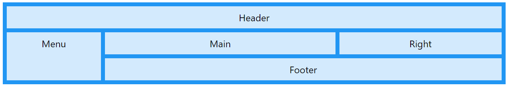

# Web FE - CSS - Part 2

- **Gird**
    - Gird hay Gird Layout cung cấp một hệ thống bố cục dạng lưới, với cột và hàng (Khá giống với col và row của Bootstrap) mà không còn cần sử dụng đến `float` hay `position`
    
    
    
    - **Display**
        - Một layout dạng lưới này phải có một element cha với `display` được set là `grid` hay `inline-grid`.
            - Khi dùng `display: grid;`, chúng ta sẽ được một container chứa grid dưới dạng block.
            - Khi dùng `display: inline-grid;`, chúng ta được 1 container chứa dạng inline-block.
        - **`grid-template-columns`**
            - Thuộc tính này xác định số cột trong bố cục grid và nó có thể xác định chiều rộng của mỗi cột.
            
            ```css
            .grid-container {
              display: grid;
              grid-template-columns: auto auto auto auto;
            }
            ```
            
            ```css
            .grid-container {
              display: grid;
              grid-template-columns: 80px 200px auto 40px;
            }
            ```
            
        - **`grid-template-rows`**
            - Thuộc tính này xác định chiều cao của mỗi hàng.
            
            ```css
            .grid-container {
              display: grid;
              grid-template-rows: 80px 200px;
            }
            ```
            
        - **`justify-content`**
            - Thuộc tính này dùng để căn chỉnh từng ô bên trong layout.
            - Có các loại:
                - `space-evenly` : khoảng cách giữa các ô bằng nhau
                - `space-around.`
                - `space-between`
                - `center`
                - `start`
                - `end`
            
            ```css
            .grid-container {
              display: grid;
              justify-content: space-evenly;
            }
            ```
            
        - **`align-content`**
            - Thuộc tính này căn chỉnh theo chiều dọc toàn bộ lưới bên trong vùng chứa.
            - Có các loại:
                - `space-evenly` : khoảng cách giữa các ô bằng nhau
                - `space-around.`
                - `space-between`
                - `center`
                - `start`
                - `end`
            
            ```css
            .grid-container {
              display: grid;
              height: 400px;
              align-content: center;
            }
            ```
            
    - ****Grid Gaps****
        - Vì là bố cục dạng lưới, nên sẽ sinh ra các khái niệm liên quan như: grid rows, grid columns và grid gaps.
        - Grid Gaps có những thuộc tính sau:
            - `column-gap`
            - `row-gap`
            - `gap`
        
        ```css
        .grid-container {
          display: grid;
        	column-gap: 50px;
          row-gap: 50px;
        }
        ```
        
    - **Grid Lines**
        - Đường kẻ giữa các hàng gọi là row lines, giữa các cột là column lines.
        
        
        
        - Ta có các thuộc tính liên quan
            - `grid-column-start`
            - `grid-column-end`
            - `grid-row-start`
            - `grid-row-end`
        
        ```css
        .item1 {
          grid-column-start: 1;
          grid-column-end: 3;
        }
        ```
        
        ```css
        .item1 {
          grid-column: 1 / 5;
        }
        ```
        
        ```css
        .item1 {
          grid-row-start: 1;
          grid-row-end: 3;
        }
        ```
        
        - **Grid Area**
            - ****`grid-area`** có thể được sử dụng nhanh thay cho `grid-row-start`, `grid-column-start`, `grid-row-end` và `grid-column-end`
            
            ```css
            .item3 {
              grid-area: 1 / 2 / 5 / 6;
            }
            ```
            
    - **Bảng tổng hợp thuộc tính**
        
        
        | Thuộc tính | Mô tả |
        | --- | --- |
        | column-gap | Chỉ định khoảng cách giữa các cột |
        | gap | Một thuộc tính tóm tắt cho các thuộc tính row-gap và column-gap |
        | grid | Một thuộc tính tóm tắt cho các thuộc tính grid-template-rows, grid-template-columns, grid-template-areas, grid-auto-rows, grid-auto-columns và grid-auto-flow |
        | grid-area | Đặt tên cho một mục lưới hoặc được sử dụng để thu gọn các thuộc tính grid-row-start, grid-column-start, grid-row-end và grid-column-end |
        | grid-auto-columns | Chỉ định kích thước cột mặc định |
        | grid-auto-flow | Chỉ định cách thức chèn các mục được tự động đặt trong lưới |
        | grid-auto-rows | Chỉ định kích thước hàng mặc định |
        | grid-column | Một thuộc tính tóm tắt cho các thuộc tính grid-column-start và grid-column-end |
        | grid-column-end | Chỉ định chỗ kết thúc của mục lưới |
        | grid-column-gap | Chỉ định kích thước khoảng cách giữa các cột |
        | grid-column-start | Chỉ định chỗ bắt đầu của mục lưới |
        | grid-gap | Một thuộc tính tóm tắt cho các thuộc tính grid-row-gap và grid-column-gap |
        | grid-row | Một thuộc tính tóm tắt cho các thuộc tính grid-row-start và grid-row-end |
        | grid-row-end | Chỉ định chỗ kết thúc của mục lưới |
        | grid-row-gap | Chỉ định kích thước khoảng cách giữa các hàng |
        | grid-row-start | Chỉ định chỗ bắt đầu của mục lưới |
        | grid-template | Một thuộc tính tóm tắt cho các thuộc tính grid-template-rows, grid-template-columns và grid-areas |
        | grid-template-areas | Chỉ định cách hiển thị cột và hàng bằng cách sử dụng các mục lưới được đặt tên |
        | grid-template-columns | Chỉ định kích thước của các cột và số lượng cột trong giao diện lưới |
        | grid-template-rows | Chỉ định kích thước của hàng trong giao diện lưới |
        | row-gap | Chỉ định khoảng cách giữa các hàng trong lưới |
- **FlexBox**
    - **Flexbox** là một kiểu dàn trang (layout mode) mà nó sẽ tự cân đối kích thước của các phần tử bên trong để hiển thị trên mọi thiết bị. Nói theo cách khác, bạn không cần thiết lập kích thước của phần tử, không cần cho nó float, chỉ cần thiết lập nó hiển thị chiều ngang hay chiều dọc, lúc đó các phần tử bên trong có thể hiển thị theo ý muốn.
    - Chúng ta sử dụng **Flexbox** để thiết lập bố cục trong phạm vi nhỏ *(ví dụ như những khung trong website)* và khi thiết lập bố cục ở phạm vi lớn hơn *(như chia cột website)* thì vẫn nên sử dụng kiểu thông thường là dàn trang theo dạng lưới *(grid layout)*.
    
    
    
    - **Flexbox Container**
        - Là thành phần lớn bao quanh các phần tử bên trong, bạn sẽ thiết lập kiểu hiển thị inline (sắp xếp theo chiều ngang) hoặc kiểu sắp xếp theo chiều dọc. Khi đó, các item bên trong sẽ hiển thị dựa trên thiết lập của container này.
        - Các thuộc tính:
            - `flex-direction`
                - Xác định hướng mà container muốn xếp chồng các flex items.
                - Có các loại: `column`, `column-reverse`, `row`, `row-reverse`.
                
                ```css
                .flex-container {
                  display: flex;
                  flex-direction: column;
                }
                ```
                
            - `flex-wrap`
                - Xác định xem các items có wrap (gói lại) hay là không ?
                - Có các loại: `wrap`, `nowarp`, `wrap-reverse`.
            - `flex-flow`
                - Một cách rút gọn của flex-direction và flex-wrap
                
                ```css
                .flex-container {
                  display: flex;
                  flex-flow: row wrap;
                }
                ```
                
            - `justify-content`
                - Dùng để căn chỉnh flex items theo chiều ngang.
                - Có các loại: `center`, `flex-start`, `flex-end`, `space-around`, `space-between`.
                
                ```css
                .flex-container {
                  display: flex;
                  justify-content: space-between;
                }
                ```
                
            - `align-items`
                - Dùng để căn chỉnh flex items theo chiều dọc.
                - Có các loại: `center`, `flex-start`, `flex-end`, `stretch`, `baseline`.
            - `align-content`
                - Dùng để căn chỉnh content của flex items
    - **Flexbox Item**
        - Các phần tử con của container được gọi là item, ở item bạn có thể thiết lập nó sẽ sử dụng bao nhiêu cột trong một container, hoặc thiết lập thứ tự hiển thị của nó.
        - Các thuộc tính:
            - `**order**`
                - Chỉnh lại thứ tự các items bên trong container.
                
                ```html
                <div class="flex-container">
                  <div style="order: 3">1</div>
                  <div style="order: 2">2</div>
                  <div style="order: 4">3</div>
                  <div style="order: 1">4</div>
                </div>
                ```
                
            - `**flex-grow**`
                - Xác định mức độ tăng trưởng của một flex items so với phần còn lại của các  flex items.
                
                ```html
                <div class="flex-container">
                  <div style="flex-grow: 1">1</div>
                  <div style="flex-grow: 1">2</div>
                  <div style="flex-grow: 8">3</div>
                </div>
                ```
                
            - `**flex-shrink**`
                - Xác định một flex items sẽ co lại bao nhiêu so với phần còn lại của các flex items.
                - Giá trị mặc định là 1.
            - `**flex-basis**`
                - Xác định chiều dài ban đầu của một flex items.
                
                ```html
                <div class="flex-container">
                  <div>1</div>
                  <div>2</div>
                  <div style="flex-basis: 200px">3</div>
                  <div>4</div>
                </div>
                ```
                
            - `**flex**`
                - Cách viết nhanh tóm gọn cho `flex-grow`, `flex-shrink`, và `flex-basis`.
                
                ```css
                .flex-item1 {
                	flex: 0 0 200px;
                }
                ```
                
            - `**align-self**`
                - Dùng để căn chỉnh cho mục đã chọn bên trong flex container.
                - Thuộc tính này có thể ghi đè giá trị căn chỉnh mặc định được đặt bởi các mục align-items của container.
                - Có các loại: center, flex-start, flex-end.
- **Media Query**
    - **Tổng quan**
        - Có một vấn đề phát sinh khi mà những thiết bị với kích cỡ màn hình nhỏ bé truy cập vào trang web của bạn.
        - Kích cỡ chữ trở nên quá nhỏ bé. Việc zoom out có thể giải quyết được vấn đề nhưng zoom out sẽ đồng nghĩa với việc phát sinh ra nhiều chỗ cần scroll một cách không cần thiết Việc phải load những hình ảnh có kích cỡ quá lớn dẫn đến giảm tốc độ load trang web trên thiết bị di động. Trong khi đáng ra với những màn hình kích cỡ nhỏ như vậy thì ta chỉ cần hiện thị những tấm hình có kích cỡ nhỏ hơn. Một trong những cách giải quyết trước đây đã từng được sử dụng rộng rãi đó là việc thiết kế view riêng cho những thiết bị moblie, và những view này được access qua một domain khác (hoặc là subdomain). Những request được gửi tới website sẽ được check xem là từ thiết bị nào, nếu là thết bị mobile thì sẽ bị redirect sang domain được tạo riêng như đã nói ở trên.
        - Ngoài việc phải tạo ra script để xác nhận thiết bị truy cập thì cách giải quyết ở trên còn gặp phải một nhược điểm khác nữa đó là ta luôn phải tạo ra 2 view khác nhau cho cùng một trang, và mỗi khi cần tay đổi một nội dung gì đó thì ta cần phải thay đổi cả hai.
        - Và **Media Query** có thể giúp ta nhận biết được thiết bị truy cập thông qua những thuộc tính của nó. Media Query giúp chúng ta áp dụng những CSS rules khác nhau cho những thiết bị có khích cỡ màn hình khác nhau. Từ đó ta có thể đạt được mục đích của mình đó là hiện thị những nội dung khác nhau (cả hình ảnh, hay text) với những thiết bị khác nhau.
    - **Media type**
        
        Media Type vốn đã có từ CSS2, nó giúp ta xác định định dạng của mỗi loại thiết bị. Tất cả các giá trị của Media Type bao gồm
        
        - All: Dùng cho tất cả các loại Media Type
        - Aural: Dùng cho speech and sound synthesizers
        - Braille: Dùng cho các devices liên quan đến chữ nổi (braille)
        - Embossed: Dùng cho các loại máy in các trang braille
        - Handheld: Dùng cho các thiết bị nhỏ, thiết bị cầm tay
        - Print: Dùng cho máy in
        - Projection: Dùng cho các loại máy chiếu
        - Screen: Dùng cho computer screen
        - Tty: Dùng cho các thiết bị sử dụng fixed-pitch character grid
        - Tv: Dùng cho các loại TV
    - ****Media Query Syntax****
        
        ```css
        @media media_type and (feature:value) { rules }
        ```
        
        - Các thuộc tính `feature` và `value` sẽ giúp chúng ta xác định chính xác từng loại màn hình mà ta mong muốn.
        - Mặc định của Media Type sẽ luôn là `all`, thế nên ta có thể lược bỏ phần `media_type` ở trên nếu muốn nó được apply cho tất cả các devices.
        - **Các feature thường dùng**
            - `width`, `height:` Nếu sử dụng feature này thì các css rules sẽ chỉ được áp dụng cho những browser có chiều rộng hoặc chiều cao đúng với thông số mà ta đã đưa ra.
            - `device-width`, `device-height`, `device-min-width`, `device-max-width`, `device-min-height`, `device-max-height`: Cũng giống như `width`, `height` hay `min-width`, `min-height`, `max-width`, `max-height`, thế nhưng với việc thêm `device-` ở phía trước thì các tính toán sẽ được dựa trên kích cỡ của thiết bị, thay vì kích cỡ của browser.
            - `aspect-ratio` và `device-aspect-ratio`: Đây là những feature cho phép ta áp dụng các rules dựa trên tỉ lệ của browser hay tỉ lệ của thiết bị. Ta có thể dùng các thông số như 16/9 hay 16/10, hoặc có thể viết cả kích cỡ cụ thể ra cho dễ đọc như 1280/720 chẳng hạn.
            - `resolution`: Đây là những feature đánh giá dựa trên độ phân giải của màn hình device (đương nhiên là không có độ phân giải cho browser rồi).
                
                ```css
                @media (max-resolution: 300dpi) { 
                	body {
                		font-size: 15px;
                	} 
                }
                ```
                
            - `orientation`: Đây là những feature đánh giá dựa trên trạng thái của thiết bị đang là là portrait (xoay dọc: khi mà chiều dài >= chiều rộng, hay là landscape (quay ngang: chiều dài < chiều rộng)
            - Ngoài ra còn một số features khác, mà có thể ít được sử dụng hơn, đó là `color`, `color-index`, `monochrome`, `scan` và `grid`
            - Ta có thể ghép nhiều media feature vào trong một câu lệnh kiểm tra bằng toán tử `and` hoặc `,` (mang ý nghĩa của phép or).
        - **Lưu ý**
            - **Nên dùng Media Query để gọi đến external stylesheet nếu có thể.** Nó sẽ giúp cho công việc quản lý và chỉnh sửa sau này trở nên dễ dàng hơn. Ta nên viết một stylesheet chung cho tất cả các device/browser trước, sau đó sẽ load riêng các stylesheet cho từng loại khác nhau, và những rules mới được load sẽ đè lên những rules cũ. Vì thế ta chỉ cần khai báo những CSS rules mà thực sự cần thay đổi với từng loại device/browser mà thôi.
            - **Nên viết, và load CSS rules của Mobile (những thiết bị có màn hình bé) trước. B**ởi giao diện dành cho những thiết bị màn hình lớn bao giờ cũng chứa những hình ảnh với kích cỡ to, và độ phân giải cao hơn so với những thiết bị màn hình nhỏ. Do đó nếu ta để những rules dành cho Desktop vào basic, và load trước thì bao giờ những assets có dung lượng tương đối lớn đó cũng được load. Giả dụ như ta có thêm trường `display: none` vào để ẩn nó đi trên những màn hình nhỏ đi chăng nữa thì nó vẫn được load vào lưu vào cache, điều đó dẫn đến tốc độ duyệt trang web của ta sẽ bị ảnh hưởng khi sử dụng các thiết bị mobile.
    - **Media Query Breakpoint**
        - **CSS Breakpoint** là những điểm (phạm vi giới hạn) mà tại đó nội dung của website sẽ co dãn một cách linh hoạt phụ thuộc vào chiều rộng của thiết bị nhằm đem đến cho người xem một trải nghiệm tuyệt vời và hoàn hảo nhất.
        - Và nếu không có những phạm vi này thì cả người thiết kế giao diện lẫn lập trình viên đều không thể biết được chính xác cách hiển thị nội dung của trang web tới người dùng, và điều tệ hại nhất mà bạn có thể nghĩ tới là sẽ xuất hiện hàng tá những trường hợp tràn chữ, lỗi font, tràn layout, khó đọc, v.v…  khi dùng điện thoại để lướt Internet.
        - **Cách đặt breakpoint**
            - **Đặt breakpoint dựa trên thiết bị**
                
                Thường thì hiện nay có 3 độ rộng phổ biến nhất:
                
                - **320px** (breakpoint thường dùng cho smartphone)
                - **768px** (breakpoint thường dùng cho tablet)
                - **1024px** (breakpoint thường dùng cho thiết bị màn hình lớn như laptop, PC, TV….).
                
                ```css
                @media only screen
                 
                and (min-device-width: 375px)
                 
                and (max-device-width: 667px)
                 
                and (-webkit-min-device-pixel-ratio: 2)
                 
                and (orientation: portrait) {
                 
                }
                ```
                
                ```css
                @media only screen
                 
                and (min-device-width: 375px)
                 
                and (max-device-width: 667px)
                 
                and (-webkit-min-device-pixel-ratio: 2)
                 
                and (orientation: landscape) {
                 
                }
                ```
                
            - **Đặt breakpoint dựa trên nội dung**
                - Cách này mình thấy được đại đa số mọi người sử dụng nhiều hơn vì nó phổ biến và dễ áp dụng.
                
                ```css
                @media only screen and (min-width: 768px) and (max-width: 1024px){
                 
                ...
                 
                }
                ```
                
                - **Lưu ý**
                    - **Nếu bạn thiết kế giao diện với cách tiếp cận mobile-first**, thì sử dụng breakpoint **min-width (chiều rộng tối thiểu)**. Khi đó, style mặc định của bạn sẽ là những thiết bị nhỏ và code bạn vừa mới tạo ra sẽ dùng để điều chỉnh cho các thiết bị lớn hơn.
                    - **Nếu bạn thiết kế cho các thiết bị lớn với cách tiếp cận desktop-first,** khi đó style mặc định của bạn sẽ là những thiết bị lớn và code bạn vừa mới tạo ra sẽ dùng để điều chỉnh cho các thiết bị nhỏ hơn với **breakpoint max-width (chiều rộng tối đa) -** tức là ta chỉ áp dụng những thứ bên trong dấu {} khi và chỉ khi màn hình nhỏ hơn hoặc bằng max-width.
            - **Đặt breakpoint dựa trên một số framework nổi tiếng**
                
                Các framework nổi tiếng hiện nay có điểm chung là đều dùng cách tiếp cận mobile-first:
                
                - **Bootstrap** sẽ có breakpoint tại 576px, 768px, 992px và 1200px.
                - **Foundation** thường sẽ có những breakpoint tại 40em và 60em.
                - **Bulma** có breakpoint sẽ được set tại độ phân giải 768px, 769px, 1024px, 1216px và 1408px.
                
                ```css
                @media (min-width: 640px){
                 
                ...
                 
                }
                 
                @media (min-width: 768px){
                 
                ...
                 
                }
                 
                @media (min-width: 1024px){
                 
                ...
                 
                }
                 
                @media (min-width: 1200px){
                 
                ...
                 
                }
                ```
                
- **Viewport**
    - Viewport là khu vực mà người dùng có thể thấy nội dung của trang web. Viewport sẽ khác nhau với các thiết bị khác nhau, Viewport của điện thoại sẽ nhỏ hơn kha khá nhiều so với của Desktop, TV,…
    
    ```html
    <meta name="viewport" content="width=device-width, initial-scale=1">
    ```
    
    - Thẻ `<meta>` viewport thiết lập cho trang web hiển thị tương ứng với kích thước của từng thiết bị khác nhau.
    - Thuộc tính `width=device-width` đặt chiều rộng của trang web theo chiều rộng màn hình của thiết bị.
    - Thuộc tính `initial-scale=1.0` thiết lập mức độ phóng ban đầu khi trang được trình duyệt tải lần đầu tiên, người dùng sẽ không thể zoom khi thuộc tính này có giá trị bằng 1.
    - Lưu ý
        - **Không sử dụng các HTML element có chiều rộng cố định quá lớn** – Ví dụ: Một hình ảnh có chiều rộng quá lớn so với chiều rộng của các thiết bị nhỏ thì khi hiển thị trên các thiết bị này hình ảnh sẽ bị tràn ra ngoài và cần phải cuộn ngang để xem được toàn bộ ảnh. Vì vậy, cần phải điều chỉnh hỉnh ảnh sao cho phù hợp với chiều rộng của từng thiết bị.
        - **KHÔNG để thiết lập Responsive dựa vào chiều rộng cụ thể** mà thay vào đó là từ kích thước nào đến kích thước nào nó sẽ hiển thị giống nhau. Ví dụ từ 240px lên 420px sẽ hiển thị giống nhau, lên trên 420px đến 720px nó giống nhau chẳng hạn.
        - Thường thì ta có thế thiết lập độ rộng `auto` hoặc giá trị là `100%` .
- **GridView**
    
    
    
    
    
    - Một responsive Grid View thường có 12 cột. Tổng chiều rộng của 12 cột này sẽ chiếm 100% chiều rộng của trang web. Các cột sẽ được thu nhỏ hoặc mở rộng theo kích thước của cửa sổ trình duyệt.
    - **Build một Responsive Grid-View**
        - **Bước 1**
            - Chúng ta thiết lập giá trị box-sizing cho thuộc tính `border-box` của tất cả các thẻ.
            - Thiết lập này có nghĩa là phần padding và border của các thành phần đều được tính vào trong tổng chiểu rộng hay chiều cao của các thành phần (xem lại bài Box Model để biết cách tính chiều rộng hoặc chiều cao).
            
            ```css
            * {
                box-sizing: border-box;
            }
            ```
            
        - **Bước 2**
            - Xây dựng một trang responsive đơn giản với 2 cột
            
            ```css
            .menu {
                width: 25%;
                float: left;
            }
            .main {
                width: 75%;
                float: left;
            }
            ```
            
        - **Bước 3**
            - Xây dựng Grid View với 12 cột.
            - Như vậy, mỗi cột sẽ có độ rộng là 100% / 12 = 8.33%.
            
            ```css
            .col-1 {width: 8.33%;}
            .col-2 {width: 16.66%;}
            .col-3 {width: 25%;}
            .col-4 {width: 33.33%;}
            .col-5 {width: 41.66%;}
            .col-6 {width: 50%;}
            .col-7 {width: 58.33%;}
            .col-8 {width: 66.66%;}
            .col-9 {width: 75%;}
            .col-10 {width: 83.33%;}
            .col-11 {width: 91.66%;}
            .col-12 {width: 100%;}
            ```
            
        - **Bước 4**
            - Tất cả các cột này đều phải trôi về phía bên trái, chúng ta sử dụng thuộc tính `float` để đạt được hiệu ứng này. Ngoài ra, các cột cũng cần có `padding` là 15px.
            
            ```css
            [class*="col-"] {
                float: left;
                padding: 15px;
                border: 1px solid red;
            }
            ```
            
        - **Bước 5**
            - Thêm thẻ `div` cho mỗi dòng. Thẻ `div` này sẽ có class là `row`. Tất cả các cột đều được đưa vào trong các dòng tương ứng.
            
            ```html
            <div class="row">
              <div class="col-3">...</div> <!-- 25% -->
              <div class="col-9">...</div> <!-- 75% -->
            </div>
            ```
            
        - **Bước 6**
            - Đến đây, chúng ta có một vấn đề: Thuộc tính `float:left` của các cột khiến cho những thành phần khác ở phía sau nó bị dồn lên (hiển thị như là các cột này không tồn tại vậy). Để tránh điều này, chúng ta thêm đoạn mã css sau cho các dòng:
            
            ```css
            .row::after {
                content: "";
                clear: both;
                display: table;
            }
            ```
            
- **Flexible Media**
    - Khi nhưng mà viewport thay đổi kích thước thì các đa công cụ (ảnh, video,..) cũng cần có đổi mới sao cho phù hợp.
    - Một cách thông dụng là set `width` là `100%` cùng với `height: auto`. Khi đó ảnh hoặc video sẽ thay đổi chiều rộng và chiều cao sao cho phù hợp với độ dãn của màn hình.
    
    ```css
    img {
      width: 100%;
      height: auto;
    }
    ```
    
    ```css
    img {
      max-width: 100%;
      height: auto;
    }
    ```
    
- **CSS Sass**
    - **Tổng quan**
        - CSS Preprocessors là một ngôn ngữ kịch bản mở rộng của CSS và được biên dịch thành cú pháp CSS giúp bạn viết CSS nhanh hơn và có cấu trúc rõ ràng hơn.
        - SASS là một chương trình tiền xử lý CSS (*CSS preprocessor).* Nó giúp bạn viết CSS theo cách của một ngôn ngữ lập trình, có cấu trúc rõ ràng, rành mạch, dễ phát triển và bảo trì code hơn.
        - Sass là chữ viết tắt của **S**yntactically **A**wesome **S**tyle **S**heets, chương trình tiền xử lý bằng ngôn ngữ kịch bản (Preprocessor Scripting Language ), sẽ được biên dịch thành CSS. Nghĩa là, mình sẽ làm style bằng SASS, rồi SASS sẽ render việc mình làm thành file CSS.
        - **SASS** bản thân có hai kiểu viết khác nhau, một kiểu như là HAML, Pug – Sử dụng indent (cách thụt đầu dòng) để phân tách các khối code , sử dụng xuống dòng để phân biệt rules , có phần mở rộng là **.sass.**
            
            ```sass
            .header
              color: #f3f3f3;
            
            .header__inner
              border: 1px solid #f3f3f3
            ```
            
            ```sass
            /* define variables for the primary colors */
            $primary_1: #a2b9bc;
            $primary_2: #b2ad7f;
            $primary_3: #878f99;
            
            /* use the variables */
            .main-header {
              background-color: $primary_1;
            }
            
            .menu-left {
              background-color: $primary_2;
            }
            
            .menu-right {
              background-color: $primary_3;
            }
            ```
            
    - ****Quy tắc xếp chồng (Nested Rule)****
        
        Cho một ví dụ sau
        
        ```css
        <div class="container">
            <div class="row">
                <div class="navbar col-12">
                    <a class="brand">Viblo</a>
                    <ul class="menu">
                        <li><a href="#">Menu 1</a></li>
                        <li><a href="#">Menu 2</a></li>
                    </ul>
                </div>
            </div>
        </div>
        ```
        
        ```css
        .navbar ul.menu {
            list-style: none;
        }
        .navbar ul.menu li {
            padding: 5px;
        }
        .navbar ul.menu li a {
            text-decoration: none;
        }
        ```
        
        ```sass
        .navbar {
            ul.menu {
                list-style: none;
        
                li {
                    padding: 5px;
        
                    a {
                        text-decoration: none;
                    }
                }
            }
        }
        ```
        
    - ****Biến (Variable)****
        - Biến chứa các giá trị mà bạn có thể sử dụng nhiều lần, ví dụ mã màu, font hay kiểu chữ....
        - Để khai báo một biến trong SASS, chúng ta sẽ viết dấu $ cùng với tên biến
    - ****Quy tắc Mixin****
        - Mixin là một cơ chế khá phổ biến trong SASS. Công dụng của nó là mang nhiều thuộc tính mà bạn đã quy ước trong một mix nào đó rồi [@include](https://viblo.asia/u/include) vào một thành phần bất kỳ mà không cần phải viết lại các thuộc tính đó (Ví dụ ở trên là color vs font-size)
        
        ```sass
        @mixin colorVsFont {
            color: #fff;
            font-size: 50px;
        }
        
        .navbar {
            ul.menu {
                list-style: none;
        
                li {
                    padding: 5px;
        
                    a {
                        text-decoration: none;
                        @include colorVsFont;
                    }
                }
            }
        }
        ```
        
        ```sass
        @mixin colorVsFont($color, $fontSize) {
            color: $color;
            font-size: $fontSize;
        }
        
        .navbar {
            ul.menu {
                list-style: none;
        
                li {
                    padding: 5px;
        
                    a {
                        text-decoration: none;
                        @include colorVsFont(#000, 50px);
                    }
                }
            }
        }
        ```
        
    - ****Extends – Kế thừa****
        - Bạn định nghĩa ra 1 class, rồi những tag nào cần sử dụng thì [@extend](https://viblo.asia/u/extend) nó vào là được rồi (Giống OOP).
        
        ```sass
        .title-box {
            color: #dacb46;
            text-shadow: 1px 1px 1px #1a1a1a;
            display: inline-block;
            text-transform: uppercase;
        }
        
        .navbar {
            ul.menu {
                list-style: none;
        
                li {
                    padding: 5px;
        
                    a {
                        text-decoration: none;
                        @extend .title-box;
                    }
                }
            }
        }
        ```
        
    - ****Import****
        
        Giả sử bạn có 1 trang index, bao gồm header, body, footer. Thay vì bạn CSS cho các phần trên vào 1 style.css thì với SASS bạn làm như sau:
        
        - Tạo 1 file **_header.scss** để CSS riêng cho header.
        - Tạo 1 file **_body.scss** để CSS riêng cho body.
        - Tạo 1 file **_footer.scss** để CSS riêng cho footer.
        - Rồi ở file style.css ta chỉ cần @import 3 file trên là ngon lành cành đào ngay
        
        
        
- **Bài tập**