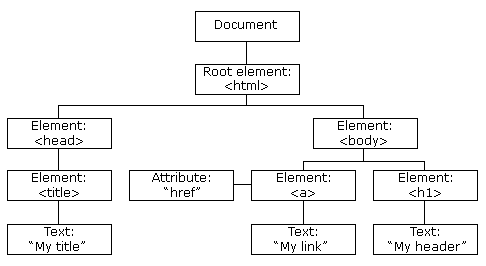

# Web FE - JavaScript

---

## JS BUỔI 1

- **Khai báo dữ liệu**
    - **Kiểu dữ liệu**
        - String: Strings are written with quotes. You can use single or double quotes.
        - Number: All JavaScript numbers are stored as decimal numbers (floating point).
        - Bigint
        - Boolean
        - Undefined
        - Null
        - Symbol
        - Object
            - An object: JavaScript objects are written with curly braces `{}`.
            - An array: JavaScript arrays are written with square brackets.
            - A date
        
        ```jsx
        // Numbers:
        let length = 16;
        let weight = 7.5;
        
        // Strings:
        let color = "Yellow";
        let lastName = "Johnson";
        
        // Booleans
        let x = true;
        let y = false;
        
        // Object:
        const person = {firstName:"John", lastName:"Doe"};
        
        // Array object:
        const cars = ["Saab", "Volvo", "BMW"];
        
        // Date object:
        const date = new Date("2022-03-25");
        ```
        
        - **Lưu ý**
            - JavaScript has dynamic types. This means that the same variable can be used to hold different data types
            
            ```jsx
            let x;       // Now x is undefined
            x = 5;       // Now x is a Number
            x = "John";  // Now x is a String
            ```
            
            - Có thể dùng typeof để trả về kiểu dữ liệu
            
            ```jsx
            typeof ""             // Returns "string"
            typeof "John"         // Returns "string"
            typeof "John Doe"     // Returns "string"
            ```
            
    - **Biến**
        - **JavaScript Variables can be khai báo in 4 ways**
            - Automatically
            - Using `var`
            - Using `let` : có thể thay đổi giá trị, nhưng không thể khai báo lại.
            - Using `const` : hằng số. (có 2 kiểu const thường và const luôn đúng)
                
                ```jsx
                const myBirthDay = "25.08.2003";
                const PI
                ```
                
        - **Lưu ý**
            - The `let` and `const` keywords were added to JavaScript in 2015.
            - The `var` keyword should only be used in code written for older browsers.
            - Always declare variables
            - Always use `const` if the value should not be changed
            - Always use `const` if the type should not be changed (Arrays and Objects)
            - Only use `let` if you can't use `const`
            - Only use `var` if you MUST support old browsers.
        
        ```jsx
        const pi = 3.14;
        let person = "John Doe";
        let answer = 'Yes I am!';
        ```
        
    - **Toán tử**
        
        
        | Operator | Description |
        | --- | --- |
        | + | Addition |
        | - | Subtraction |
        | * | Multiplication |
        | ** | Lũy thừa  |
        | / | Division |
        | % | Modulus (Division Remainder) |
        | ++ | Increment |
        | -- | Decrement |
        | == | equal to |
        | === | equal value and equal type |
        | != | not equal |
        | !== | not equal value or not equal type |
        | > | greater than |
        | < | less than |
        | >= | greater than or equal to |
        | <= | less than or equal to |
        | ? | toán tử ba ngôi |
        | = | x = y |
        | += | x = x + y |
        | -= | x = x - y |
        | *= | x = x * y |
        | /= | x = x / y |
        | %= | x = x % y |
        | **= | x = x ** y |
        | && | logical and |
        | || | logical or |
        | ! | logical not |
        | typeof | Returns the type of a variable |
        | instanceof | Returns true if an object is an instance of an object type |
        | & | AND |
        | | | OR |
        | ~ | NOT |
        | ^ | XOR |
        | << | left shift |
        | >> | right shift |
        | >>> | unsigned right shift |
        - Lưu ý:
            - Cộng 2 string cần có `“ ”` ở giữa.
            - Có thể dùng `+=` với string.
            
            ```jsx
            let text3 = text1 + " " + text2;
            
            let text1 = "What a very ";
            text1 += "nice day";
            ```
            
- **Các đối tượng trong JavaScript**
    - **Array**
        
        ```jsx
        const cars = ["Saab", "Volvo", "BMW"];
        
        const cars = [];
        cars[0]= "Saab";
        cars[1]= "Volvo";
        cars[2]= "BMW";
        
        const cars = new Array("Saab", "Volvo", "BMW");
        // 
        const points = new Array(40); // Avoid using new Array().
        // is not the same as:
        const points = [40]; // 
        
        // Dự đoán kết quả của đoạn sau
        document.getElementById("demo").innerHTML = cars;
        ```
        
        ```jsx
        const cars = ["Saab", "Volvo", "BMW"];
        let car = cars[0];
        ```
        
        - Các method của mảng
            
            ```jsx
            cars.length;   // Returns the number of elements
            cars.sort();   // Sorts the array
            fruits.forEach(myFunction); // Vòng lặp với mảng
            fruits.push("Lemon");  // Adds a new element (Lemon) to fruits
            fruits[fruits.length] = "Lemon";  // Adds "Lemon" to fruits
            ```
            
        - Mảng kết hợp
            
            ```jsx
            const person = [];
            person[0] = "John";
            person[1] = "Doe";
            person[2] = 46;
            person.length;    // Will return 3
            person[0];        // Will return "John"
            ```
            
        - Array Method
            - `Array length`
            - `Array toString()`
                
                ```jsx
                const fruits = ["Banana", "Orange", "Apple", "Mango"];
                document.getElementById("demo").innerHTML = fruits.toString();
                // Banana,Orange,Apple,Mango
                ```
                
            - `Array pop()`
            - `Array push()`
            - `Array shift()` removes the first array element and "shifts" all other elements to a lower index.
                
                ```jsx
                const fruits = ["Banana", "Orange", "Apple", "Mango"];
                
                let fruit = fruits.shift();
                // Banana
                
                // --------------
                fruits.shift();
                
                // Orange,Apple,Mango
                ```
                
            - `Array unshift()` method adds a new element to an array (at the beginning), and "unshifts" older elements (ngược lại với `shift()`).
            - `Array join()`
                
                ```jsx
                const fruits = ["Banana", "Orange", "Apple", "Mango"];
                document.getElementById("demo").innerHTML = fruits.join(" * ");
                // Banana * Orange * Apple * Mango
                ```
                
            - `Array delete()`
                - Using `delete` leaves `undefined` holes in the array.
                - Use `pop()` or `shift()` instead.
            - `Array concat()` method creates a new array by merging (concatenating) existing arrays:
                
                ```jsx
                const arr1 = ["Cecilie", "Lone"];
                const arr2 = ["Emil", "Tobias", "Linus"];
                const arr3 = ["Robin", "Morgan"];
                const myChildren = arr1.concat(arr2, arr3);
                ```
                
            - `Array flat()` creates a new array with sub-array elements concatenated to a specified depth.
                
                ```jsx
                const myArr = [[1,2],[3,4],[5,6,7],["PR"]];
                const newArr = myArr.flat();
                
                // 1,2,3,4,5,6,7,PR
                ```
                
            - `Array splice()` can be used to add new items to an array:
                - The first parameter (2) defines the position **where** new elements should be **added** (spliced in).
                - The second parameter (0) defines **how many** elements should be **removed**.
                - The rest of the parameters ("Lemon" , "Kiwi") define the new elements to be **added**.
                
                ```jsx
                const fruits = ["Banana", "Orange", "Apple", "Mango"];
                fruits.splice(2, 0, "Lemon", "Kiwi");
                ```
                
            - `Array slice()` to remove elements without leaving "holes" in the array:
                
                ```jsx
                const fruits = ["Banana", "Orange", "Apple", "Mango"];
                
                fruits.splice(0, 1);
                // Orange,Apple,Mango
                
                ///------------------------
                const citrus = fruits.slice(1);
                // Orange,Lemon,Apple,Mango
                ```
                
            - `Array sort()`
                
                ```jsx
                const fruits = ["Banana", "Orange", "Apple", "Mango"];
                fruits.sort();
                // Apple,Banana,Mango,Orange
                fruits.reverse();
                // Orange,Mango,Banana,Apple
                ```
                
                ```jsx
                const points = [40, 100, 1, 5, 25, 10];
                points.sort(function(a, b){return a - b});
                // 1,5,10,25,40,100
                ```
                
            - `Array max()` và `Array min()`
                
                ```jsx
                function myArrayMax(arr) {
                  return Math.max.apply(null, arr);
                }
                // 100
                
                function myArrayMin(arr) {
                  return Math.min.apply(null, arr);
                }
                // 1
                ```
                
            - `Array map()`
                - The `map()` method creates a new array by performing a function on each array element.
                - The `map()` method does not execute the function for array elements without values.
                
                ```jsx
                const numbers1 = [45, 4, 9, 16, 25];
                const numbers2 = numbers1.map(myFunction);
                
                function myFunction(value, index, array) {
                  return value * 2;
                }
                
                // 90,8,18,32,50
                
                function myFunction(value) {
                  return value * 2;
                }
                const newArr = myArr.flatMap((x) => x * 2);
                ```
                
            - `Array flatMap()`
                - first maps all elements of an array and then creates a new array by flattening the array.
                
                ```jsx
                const vehicles = [
                  {
                    name: "car",
                    symbol: "🚙",
                    companies: ["Toyota", "Ferrari", "Ford", "Jaguar"],
                  },
                  {
                    name: "bicycle",
                    symbol: "🚲",
                    companies: ["Ares", "Kuwahara"],
                  },
                  {
                    name: "train",
                    symbol: "🚆",
                    companies: [],
                  },
                  {
                    name: "scooter",
                    symbol: "🛴",
                    companies: ["Besrey"],
                  },
                ];
                ```
                
                ```jsx
                const companies = vehicles.map(vehicle => vehicle.companies).flat();
                
                ```
                
                ```jsx
                [
                    [
                        "Toyota",
                        "Ferrari",
                        "Ford",
                        "Jaguar"
                    ],
                    [
                        "Ares",
                        "Kuwahara"
                    ],
                    [],
                    [
                        "Besrey"
                    ]
                ]
                ```
                
                ```jsx
                const companies = vehicles.flatMap(vehicle => vehicle.companies);
                ```
                
                ```jsx
                ["Toyota", "Ferrari", "Ford", "Jaguar", "Ares", "Kuwahara", "Besrey"];
                ```
                
            - `Array filter()`
                
                ```jsx
                array.filter(function(element, index, array) {
                  // Điều kiện lọc
                });
                
                // `array` là mảng gốc mà bạn muốn lọc các phần tử từ.
                // `element` là phần tử hiện tại đang được lọc trong quá trình lặp qua mảng.
                // `index` là chỉ mục của `element` trong mảng.
                // `array` là chính mảng gốc mà bạn đang lọc.
                ```
                
                ```jsx
                const numbers = [45, 4, 9, 16, 25];
                const over18 = numbers.filter(myFunction);
                
                function myFunction(value) {
                  return value > 18;
                }
                // 45,25
                ```
                
            - `Array reduce()`
                
                ```jsx
                array.reduce(callback, initialValue);
                // `array`: Mảng ban đầu.
                // `callback`: Một hàm callback được gọi cho từng phần tử trong mảng, có thể nhận vào bốn tham số: accumulator (biến trung gian), currentValue (giá trị hiện tại đang được xử lý), currentIndex (chỉ số hiện tại), và array (mảng đang được reduce).
                // `initialValue` (tùy chọn): Giá trị khởi tạo ban đầu của biến trung gian (accumulator). Nếu không được chỉ định, phần tử đầu tiên của mảng sẽ được sử dụng làm giá trị khởi tạo.
                ```
                
                ```jsx
                const numbers = [45, 4, 9, 16, 25];
                let sum = numbers.reduce(myFunction);
                
                function myFunction(total, value) {
                  return total + value;
                }
                // 99
                ```
                
            - `Array indexOf()`
                - Là một phương thức của một mảng trong JavaScript, được sử dụng để tìm kiếm và trả về chỉ mục (vị trí) đầu tiên mà phần tử **`value`** xuất hiện trong mảng.
                
                ```jsx
                const numbers = [45, 4, 9, 45, 25];
                numbers.indexOf(45);
                // 0
                ```
                
            - `Array forEach()`
                
                ```jsx
                array.forEach(callback(currentValue, index, array), thisArg)
                ```
                
    - **Object**
        
        ```jsx
        const car = {type:"Fiat", model:"500", color:"white"};
        ```
        
        ```jsx
        objectName.propertyName
        
        objectName["propertyName"]
        ```
        
        ```jsx
        const person = {
          firstName: "John",
          lastName : "Doe",
          id       : 5566,
          fullName : function() {
            return this.firstName + " " + this.lastName;
          }
        };
        ```
        
    - **Lưu ý**
        - When a JavaScript variable is declared with the keyword "`new`", the variable is created as an object. Avoid `String`, `Number`, and `Boolean` objects. They complicate your code and slow down execution speed.
        - Trong JavaScript, mảng sử dụng các chỉ mục được đánh số. Còn, các đối tượng sử dụng các chỉ mục được đặt tên.
        - Const Object có thể thay đổi các properties của nó được, chứ không thể gán 1 object mới được. Vì const sẽ lưu lại địa chỉ của nó.
        - How to Recognize an Array ? The problem is that the JavaScript operator `typeof` returns "`object`":
        
        ```jsx
        const fruits = ["Banana", "Orange", "Apple"];
        let type = typeof fruits;
        
        // Cách 1
        Array.isArray(fruits); // return true
        fruits instanceof Array; // return true
        ```
        
    - **Hàm (function)**
        - A JavaScript function is a block of code designed to perform a particular task.
        
        ```jsx
        function name(parameter1, parameter2, parameter3) {
          // code to be executed
        }
        ```
        
        ```jsx
        function myFunction(p1, p2) {
          return p1 * p2;
        }
        ```
        
        ```jsx
        function toCelsius(fahrenheit) {
          return (5/9) * (fahrenheit-32);
        }
        
        let value1 = toCelsius(77);
        // 25
        let value2 = toCelsius();
        // NaN
        let value3 = toCelsius;
        // function toCelsius(fahrenheit) { return (5/9) * (fahrenheit-32); }
        ```
        
- **Vòng lặp**
    - JavaScript supports different kinds of loops:
        - `for` - loops through a block of code a number of times
            - Tương tự các code C, CPP, Java
            
            ```jsx
            for (let i = 0; i < 5; i++) {
              text += "The number is " + i + "<br>";
            }
            ```
            
            - Có sự khác biệt giữa dùng `var` và `let` với vòng lặp.
            
            ```jsx
            var i = 5;
            
            for (var i = 0; i < 10; i++) {
              // some code
            }
            
            // Here i is 10
            ```
            
            ```jsx
            let i = 5;
            
            for (let i = 0; i < 10; i++) {
              // some code
            }
            
            // Here i is 5
            ```
            
        - `for/in` - loops through the properties of an object
            - loops through the properties of an Object and Array
            
            ```jsx
            const person = {fname:"John", lname:"Doe", age:25};
            
            let text = "";
            for (let x in person) {
              text += person[x];
            }
            // John Doe 25
            ```
            
            ```jsx
            const numbers = [45, 4, 9, 16, 25];
            
            let txt = "";
            for (let x in numbers) {
              txt += numbers[x];
            }
            ```
            
            ```jsx
            const numbers = [45, 4, 9, 16, 25];
            
            let txt = "";
            numbers.forEach(myFunction);
            
            function myFunction(value) {
              txt += value;
            }
            ```
            
        - `for/of` - loops through the values of an iterable object
            - It lets you loop over iterable data structures such as Arrays, Strings, Maps, NodeLists, …
            
            ```jsx
            const cars = ["BMW", "Volvo", "Mini"];
            
            let text = "";
            for (let x of cars) {
              text += x;
            }
            ```
            
            ```jsx
            let language = "JavaScript";
            
            let text = "";
            for (let x of language) {
            text += x;
            }
            ```
            
        - `while` - loops through a block of code while a specified condition is true
            - Tương tự C, CPP, Java.
        - `do/while` - also loops through a block of code while a specified condition is true
    - Break và Continue:
        
        ```jsx
        for (let i = 0; i < 10; i++) {
          if (i === 3) { break; }
          text += "The number is " + i + "<br>";
        }
        ```
        
        ```jsx
        for (let i = 0; i < 10; i++) {
          if (i === 3) { continue; }
          text += "The number is " + i + "<br>";
        }
        ```
        
- **Call back**
    - Using a callback, you could call the calculator function (`myCalculator`) with a callback (`myCallback`), and let the calculator function run the callback after the calculation is finished
    
    ```jsx
    function myDisplayer(some) {
      document.getElementById("demo").innerHTML = some;
    }
    
    function myCalculator(num1, num2) {
      let sum = num1 + num2;
      return sum;
    }
    
    let result = myCalculator(5, 5);
    myDisplayer(result);
    ```
    
    ```jsx
    function myDisplayer(some) {
      document.getElementById("demo").innerHTML = some;
    }
    
    function myCalculator(num1, num2, myCallback) {
      let sum = num1 + num2;
      myCallback(sum);
    }
    
    myCalculator(5, 5, myDisplayer);
    
    // 10
    ```
    
    - In the example above, `myDisplayer` is a called a **callback function**. Nó trở thành 1 đối số của `myCalculator`.
    - Lưu ý:
        - When you pass a function as an argument, remember not to use parenthesis.
        - Right: `myCalculator(5, 5, myDisplayer);`
        - Wrong: ~~`myCalculator(5, 5, myDisplayer())~~;`
    - Khi nào dùng callBack ?
        - Where callbacks really shine are in asynchronous (không đồng bộ) functions, where one function has to wait for another function (like waiting for a file to load).
- **Các method trong JavaScript: Map, Reduce, Filter, Some, Includes ....**
    - Map
        - Đặc điểm của `map`
            - `map()` creates a new array from calling a function for every array element.
            - `map()` does not execute the function for empty elements.
            - `map()` does not change the original array.
        - `Array map()`
            
            ```jsx
            const numbers = [65, 44, 12, 4];
            const newArr = numbers.map(myFunction)
            
            function myFunction(num) {
              return num * 10;
            }
            
            // [650, 440, 120, 40]
            ```
            
    - Reduce
        - Đặc điểm
            - The `reduce()` method executes a reducer function for array element.
            - The `reduce()` method returns a single value: the function's accumulated result.
            - The `reduce()` method does not execute the function for empty array elements.
            - The `reduce()` method does not change the original array.
        - `Array Reduce`
            
            ```jsx
            const numbers = [175, 50, 25];
            
            document.getElementById("demo").innerHTML = numbers.reduce(myFunc);
            
            function myFunc(total, num) {
              return total - num;
            }
            // 100
            ```
            
        - Lưu ý
            - At the first callback, there is no return value from the previous callback.
    - Filter
        - Đặc điểm
            - The `filter()` method creates a new array filled with elements that pass a test provided by a function.
            - The `filter()` method does not execute the function for empty elements.
            - The `filter()` method does not change the original array.
        - `Array Filter`
            
            ```jsx
            const ages = [32, 33, 16, 40];
            const result = ages.filter(checkAdult);
            
            function checkAdult(age) {
              return age >= 18;
            }
            ```
            
    - Some
        - Đặc điểm
            - The `some()` method checks if any array elements pass a test (provided as a callback function).
            - The `some()` method executes the callback function once for each array element.
            - The `some()` method returns `true` (and stops) if the function returns `true` for one of the array elements.
            - The `some()` method returns `false` if the function returns `false` for all of the array elements.
            - The `some()` method does not execute the function for empty array elements.
            - The `some()` method does not change the original array.
        - `Array Some`
            
            ```jsx
            const ages = [3, 10, 18, 20];
            
            ages.some(checkAdult);
            function checkAdult(age) {
              return age > 18;
            }
            
            // true
            ```
            
    - Includes
        - Đặc điểm
            - The `includes()` method returns `true` if an array contains a specified value.
            - The `includes()` method returns `false` if the value is not found.
            - The `includes()` method is case sensitive.
        - `Array Includes`
            
            ```jsx
            const fruits = ["Banana", "Orange", "Apple", "Mango"];
            fruits.includes("Banana", 3);
            ```
            

---

## JS BUỔI 2 - Tìm hiểu về JS ES6

- **Từ khóa let, const**
    - The `let` keyword allows you to declare a variable with block scope.
    - The `const` keyword allows you to declare a constant (a JavaScript variable with a constant value). Constants are similar to let variables, except that the value cannot be changed.
    
    ```jsx
    var x = 10;
    // Here x is 10
    {
      let x = 2;
      // Here x is 2
    }
    // Here x is 10
    ```
    
- **Arrow function**
    - Arrow functions allows a short syntax for writing function expressions. You don't need the `function` keyword, the `return` keyword, and the **curly brackets**.
    
    ```jsx
    // ES5
    var x = function(x, y) {
       return x * y;
    }
    
    // ES6
    const x = (x, y) => x * y;
    ```
    
    - Arrow functions do not have their own `this`. They are not well suited for defining **object methods**.
    - Arrow functions are not hoisted (tức là không được đưa lên đầu phạm vi). They must be defined **before** they are used.
    
    ```jsx
    // Arrow function được định nghĩa trước khi sử dụng
    const calculate = (a, b) => a + b;
    const result = calculate(5, 10);
    console.log(result);
    ```
    
    ```jsx
    // Arrow function không được định nghĩa trước khi sử dụng
    const result = calculate(5, 10); // Lỗi: calculate is not a function
    const calculate = (a, b) => a + b;
    ```
    
- **Template literals - Template strings**
    - cho phép bạn tạo ra chuỗi với cú pháp linh hoạt và thêm biểu thức hoặc giá trị vào trong chuỗi một cách dễ dàng.
    - Template literals được bao quanh bởi cặp dấu backtick (`` ``) thay vì dấu nháy đơn (`' '`) hoặc nháy kép (`" "`). Bên trong template literals, bạn có thể sử dụng các biểu thức JavaScript và các biến bằng cách sử dụng cú pháp `${expression}`.
    - Template literals cho phép bạn tạo ra các chuỗi phức tạp và tùy chỉnh một cách dễ dàng, làm cho mã JavaScript trở nên dễ đọc và dễ hiểu hơn so với việc sử dụng chuỗi thông thường.
    
    ```jsx
    const name = 'John';
    const age = 30;
    
    // Sử dụng template literals
    const greeting = `Xin chào, tôi là ${name} và tôi ${age} tuổi.`;
    
    console.log(greeting);
    // Output: Xin chào, tôi là John và tôi 30 tuổi.
    ```
    
- **Destructuring**
    - Cho phép bạn trích xuất các giá trị từ một đối tượng hoặc mảng và gán chúng vào các biến riêng lẻ một cách thuận tiện.
    - Khi sử dụng destructuring, bạn có thể chỉ định các biến mới và gán giá trị tương ứng từ đối tượng hoặc mảng nguồn một cách ngắn gọn.
    
    ```jsx
    const person = { name: 'John', age: 30 };
    
    const { name, age } = person;
    
    console.log(name); // Output: John
    console.log(age); // Output: 30
    ```
    
    ```jsx
    const numbers = [1, 2, 3, 4, 5];
    
    const [first, second, ...rest] = numbers;
    
    console.log(first); // Output: 1
    console.log(second); // Output: 2
    console.log(rest); // Output: [3, 4, 5]
    ```
    
- **Spread**
    - The `...` operator expands an iterable (like an array) into more elements.
    - The `...` operator can be used to expand an iterable into more arguments for function calls.
    - Khi sử dụng toán tử **`...`** trên một mảng, nó được gọi là "spread operator" và có thể được sử dụng để sao chép mảng, kết hợp các mảng lại với nhau, hoặc truyền các phần tử của mảng vào một hàm theo dạng các đối số riêng biệt.
    
    ```jsx
    const numbers = [1, 2, 3, 4, 5];
    const copiedNumbers = [...numbers]; // Sao chép mảng
    
    const moreNumbers = [6, 7, 8];
    const combinedNumbers = [...numbers, ...moreNumbers]; // Kết hợp các mảng
    
    function sum(a, b, c) {
      return a + b + c;
    }
    
    const result = sum(...numbers); // Truyền các phần tử của mảng vào hàm
    ```
    
    - Khi sử dụng toán tử `...` trên một đối tượng, nó được gọi là "rest operator" và có thể được sử dụng để lấy các thuộc tính của đối tượng vào một đối tượng mới hoặc lấy các tham số còn lại của một hàm vào một mảng.
    
    ```jsx
    const person = {
      name: 'John',
      age: 30,
      country: 'USA'
    };
    
    const { name, ...rest } = person; // Lấy thuộc tính name và các thuộc tính còn lại vào đối tượng rest
    
    function printInfo(name, ...details) {
      console.log(`Name: ${name}`);
      console.log(`Details: ${details}`);
    }
    
    printInfo('John', '30', 'USA'); // Lấy các tham số còn lại vào một mảng details
    
    // Output 
    // 
    // Name: John
    // Details: 30,USA
    ```
    

---

## JS BUỔI 3 - DOM

- **HTML DOM**
    - Khi một trang web được tải, trình duyệt tạo ra một Document Object Model (DOM) của trang đó.
    - Mô hình DOM HTML được xây dựng dưới dạng một cây các đối tượng
        
        
        
        **The HTML DOM Tree of Objects**
        
    - DOM HTML là một mô hình đối tượng và giao diện lập trình tiêu chuẩn cho HTML. Nó xác định:
        - Các phần tử HTML như các đối tượng.
        - Các thuộc tính của tất cả các phần tử HTML.
        - Các phương thức để truy cập vào tất cả các phần tử HTML.
        - Các sự kiện cho tất cả các phần tử HTML.
        
        Nói cách khác: DOM HTML là một tiêu chuẩn cho cách lấy, thay đổi, thêm hoặc xóa các phần tử HTML.
        
- **DOM API (DOM Methods)**
    - DOM API cung cấp các phương thức như:
        - `document.getElementById()`: Trả về phần tử có id tương ứng.
        - `document.querySelector()`: Trả về phần tử đầu tiên khớp với selector CSS được chỉ định.
        - `document.createElement()`: Tạo một phần tử HTML mới.
        - `element.appendChild()`: Thêm một phần tử con vào phần tử hiện tại.
        - `element.innerHTML`: Truy cập hoặc thiết lập nội dung HTML của một phần tử.
        - `element.addEventListener()`: Đăng ký một hàm xử lý sự kiện cho một phần tử.
        - `element.style`: Truy cập hoặc thiết lập các thuộc tính CSS của một phần tử.
- DOM Document Object
- DOM Attribute
- DOM CSS
- DOM Event
- InnerText, textContent, InnerHTML
- PreventDefault & StopPropagation
- Get element methods
- Event listener